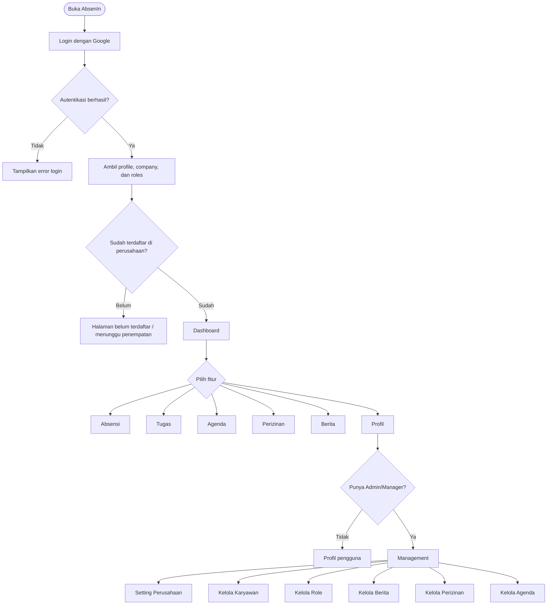
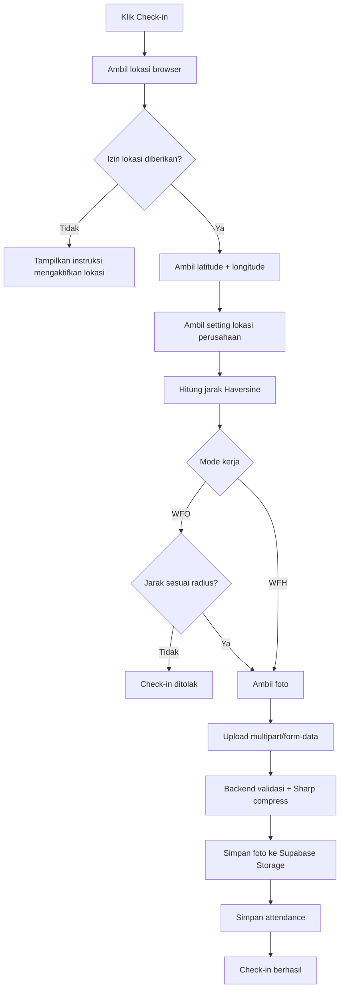
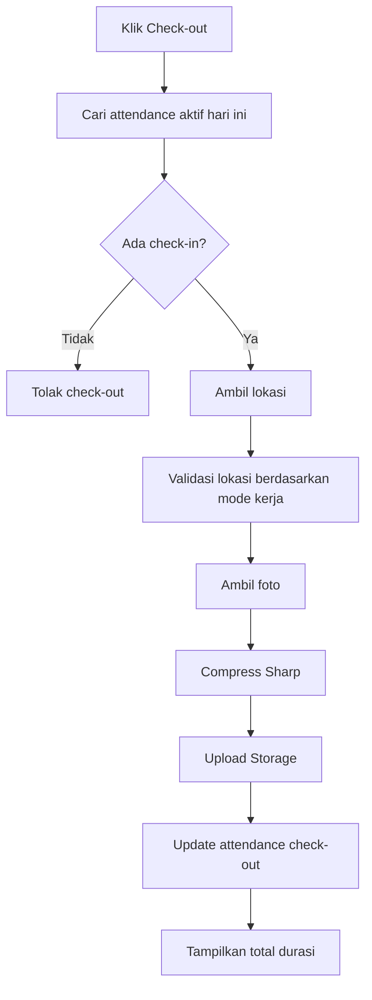
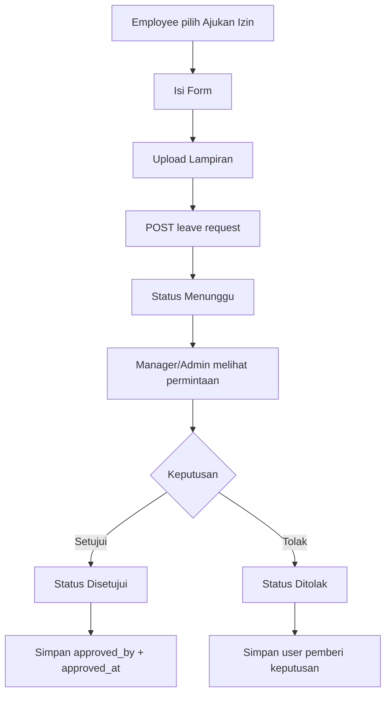
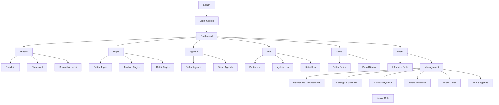

# PRODUCT REQUIREMENT DOCUMENT (PRD)
## AbsenIn — Aplikasi Absensi dan Manajemen Karyawan Berbasis Web/PWA

> **Versi:** 2.0 — diselaraskan dengan `schema-db.md`
> 
> **Fokus utama:** absensi GPS + bukti foto, tugas, agenda, perizinan, berita, dan sisi manajemen perusahaan dengan dukungan multi-role.

---

## 1. DESKRIPSI PRODUK

AbsenIn adalah aplikasi absensi karyawan berbasis web/PWA yang membantu karyawan melakukan check-in dan check-out menggunakan lokasi, bukti foto, serta mode kerja WFO/WFH. Selain absensi, aplikasi menyediakan tugas, agenda, pengajuan izin, berita perusahaan, dan area manajemen untuk mengelola data perusahaan serta karyawan.

Login menggunakan Google. Setelah berhasil masuk, sistem membaca profil pengguna, perusahaan yang diikuti, dan seluruh role yang dimiliki pengguna. Satu pengguna dapat memiliki lebih dari satu role, misalnya `Employee + Manager` atau `Employee + Admin`.

---

## 2. PROBLEM STATEMENT & GOAL

### 2.1 Problem Statement

Pengelolaan kehadiran karyawan dapat menjadi kurang terstruktur ketika absensi, izin, informasi perusahaan, tugas, dan agenda masih berjalan melalui media yang berbeda. AbsenIn menyatukan proses tersebut dalam satu aplikasi sehingga data tersimpan secara terpusat dan dapat diakses sesuai hak akses pengguna.

### 2.2 Goal

Membangun aplikasi yang mampu:

1. menyediakan login aman menggunakan Google;
2. mencatat check-in dan check-out dengan tanggal, waktu, mode kerja, koordinat, alamat, dan bukti foto;
3. membantu karyawan mengelola tugas personal maupun tugas yang ditujukan untuk kelompok;
4. menyediakan agenda kegiatan dengan waktu mulai, waktu selesai, dan catatan;
5. menyediakan pengajuan izin sakit, izin, dan cuti beserta lampiran dan status approval;
6. menyediakan berita perusahaan dalam kategori `Pengumuman` dan `Tips & Info`;
7. menyediakan area manajemen perusahaan untuk pengaturan perusahaan, lokasi, jam kerja, karyawan, role, berita, dan perizinan;
8. mendukung satu pengguna memiliki banyak role;
9. membatasi akses data antarperusahaan melalui authorization dan RLS;
10. mengompres foto di sisi backend menggunakan Sharp sebelum disimpan ke Supabase Storage.

---

## 3. SCOPE APLIKASI

### 3.1 In Scope

| Modul | Fitur |
|---|---|
| Authentication | Login Google, logout, cek sesi, profil pengguna |
| Dashboard Karyawan | Status absensi, ringkasan tugas, agenda, izin, berita |
| Absensi | Check-in, check-out, GPS, alamat, foto, WFO/WFH, riwayat |
| Tugas | Buat, lihat, ubah, selesaikan, hapus tugas |
| Agenda | Lihat dan kelola agenda sesuai hak akses |
| Perizinan | Ajukan izin, lampiran, cek status, approval/rejection |
| Berita | Lihat berita, buat, ubah, hapus, sampul, kategori |
| Management | Setting perusahaan, lokasi, jam kerja, karyawan, role |
| Multi-role | Satu profile dapat mempunyai Admin, Manager, dan Employee |

### 3.2 Out of Scope untuk versi awal

- payroll/penggajian;
- face recognition;
- fingerprint hardware;
- aplikasi native Android/iOS;
- integrasi Slack/Teams;
- sistem kelompok lengkap seperti `groups` dan `group_members`, karena belum terdapat pada schema terbaru.

---

## 4. ROLE DAN HAK AKSES

### 4.1 Role pada database

Role yang tersedia pada `user_role_enum` adalah:

- `Admin`
- `Manager`
- `Employee`

Role disimpan di tabel `profile_roles`, sehingga satu profile dapat memiliki beberapa role.

### 4.2 Konsep akses

| Fitur | Employee | Manager | Admin |
|---|:---:|:---:|:---:|
| Dashboard pribadi | ✅ | ✅ | ✅ |
| Check-in/out | ✅ | ✅ | ✅ |
| Riwayat absensi pribadi | ✅ | ✅ | ✅ |
| Lihat data absensi karyawan | ❌ | ✅ | ✅ |
| Ajukan izin | ✅ | ✅ | ✅ |
| Approve/reject izin | ❌ | ✅ | ✅ |
| Kelola agenda | ❌* | ✅ | ✅ |
| Buat/edit berita | ❌ | ✅ | ✅ |
| Lihat berita | ✅ | ✅ | ✅ |
| Ubah setting perusahaan | ❌ | ❌ | ✅ |
| Kelola karyawan | ❌ | ❌ | ✅ |
| Kelola role karyawan | ❌ | ❌ | ✅ |
| Kelola lokasi kantor | ❌ | ❌ | ✅ |
| Kelola hari & jam kerja | ❌ | ❌ | ✅ |

`*` Mengikuti RLS schema saat ini: insert/update agenda diberikan kepada manager. Tampilan UI dapat tetap menampilkan agenda kepada seluruh karyawan.

---

## 5. KONSEP MULTI-ROLE

Contoh kondisi satu pengguna:

```text
Profil Ervina
├── Employee
└── Manager
```

Dashboard utama tetap satu. Perbedaan tampilan didasarkan pada kemampuan yang dimiliki user.

```text
Login Google
      ↓
Ambil profile + roles + company
      ↓
Apakah mempunyai Admin/Manager?
   ┌──┴─────┐
   │ Tidak  │ Ya
   ↓        ↓
Karyawan   Dashboard + menu Management
```

Menu `Management` sebaiknya muncul di halaman profil, bukan membuat akun/role terpisah. User tetap dapat menggunakan fungsi Employee sambil menjalankan fungsi Manager/Admin.

---

## 6. USER FLOW UTAMA



---

## 7. DASHBOARD KARYAWAN

Dashboard menjadi halaman utama setelah login.

### Komponen utama

1. **Header**
   - logo/nama AbsenIn;
   - notifikasi (opsional tahap lanjut);
   - avatar dan nama user.

2. **Kartu Absensi Hari Ini**
   - tanggal hari ini;
   - jam kerja perusahaan;
   - status check-in;
   - jam check-in;
   - status check-out;
   - jam check-out;
   - mode kerja.

3. **Quick Access**
   - Check-in / Check-out;
   - Tugas;
   - Agenda;
   - Izin.

4. **Ringkasan**
   - jumlah tugas aktif;
   - agenda terdekat;
   - izin yang masih menunggu;
   - berita terbaru.

---

## 8. MODUL ABSENSI

### 8.1 Check-in

Flow:



### 8.2 Data yang dikirim

| Field | Sumber | Wajib |
|---|---|:---:|
| `work_mode` | pilihan user | ✅ |
| `latitude` | Geolocation API | ✅ |
| `longitude` | Geolocation API | ✅ |
| `address` | hasil reverse-geocoding / sumber alamat yang digunakan aplikasi | ✅ |
| `photo` | camera/upload | ✅ |

### 8.3 Data yang disimpan

Tabel `attendances` menyimpan data check-in pada `check_in_time`, `check_in_latitude`, `check_in_longitude`, `check_in_address`, dan `check_in_photo_url`. Untuk check-out digunakan kolom pasangan `check_out_*`. fileciteturn0file0L41-L66

### 8.4 Aturan bisnis

- satu user hanya boleh mempunyai satu record absensi aktif per hari;
- check-in tidak boleh dilakukan apabila masih ada record hari itu yang sudah check-in dan belum check-out;
- WFO harus melewati validasi radius lokasi kantor;
- WFH tetap mencatat koordinat dan alamat, tetapi tidak perlu membatasi radius kantor;
- waktu absensi berasal dari server/database, bukan dari waktu yang diketik user;
- foto wajib berhasil diproses sebelum attendance disimpan;
- check-out hanya dapat dilakukan terhadap attendance milik user yang belum mempunyai `check_out_time`;
- user tidak dapat mengubah timestamp absensi melalui request client.

### 8.5 Check-out



---

## 9. MODUL TUGAS

Tugas berisi:

- nama tugas (`title`);
- deadline tanggal dan jam (`deadline`);
- catatan (`notes`);
- status selesai (`is_completed`);
- pemilik/target profile (`profile_id`);
- kategori (`task_category_id`).

Tabel `tasks` saat ini memiliki field tersebut dan terikat ke `company_id`. fileciteturn0file0L68-L87

### Flow karyawan

```text
Dashboard
  ↓
Tugas
  ├── Semua
  ├── Belum selesai
  └── Selesai
       ↓
    + Tambah Tugas
       ↓
    Isi form
       ├── Nama tugas
       ├── Deadline tanggal
       ├── Deadline jam
       ├── Catatan
       └── Tipe/kategori
       ↓
    Simpan
```

### Catatan schema untuk Personal/Grup

`task_type_enum` memang tersedia dengan nilai `Personal` dan `Grup`, tetapi pada schema saat ini tabel `tasks` belum mempunyai kolom yang memakai enum tersebut. Selain itu belum ada tabel `groups`/`group_members`. Karena itu:

- **Personal** dapat dipetakan ke `profile_id`.
- **Grup** belum dapat direpresentasikan secara lengkap sebagai tugas kelompok berdasarkan schema saat ini.

Untuk benar-benar mendukung tugas grup, perubahan minimal yang disarankan:

```sql
ALTER TABLE tasks
ADD COLUMN task_type task_type_enum NOT NULL DEFAULT 'Personal';

-- diperlukan juga bila "Grup" berarti kelompok karyawan:
-- group_id uuid REFERENCES groups(id)
```

Perubahan tabel `groups` dan `group_members` baru diperlukan bila AbsenIn memang akan mempunyai konsep kelompok karyawan secara eksplisit.

---

## 10. MODUL AGENDA

Field agenda:

- `title` — nama kegiatan;
- `start_time` — tanggal/waktu mulai;
- `end_time` — tanggal/waktu selesai;
- `notes` — catatan tambahan;
- `company_id`;
- `profile_id`;
- `agenda_category_id`.

Kolom tersebut tersedia pada tabel `agenda`. fileciteturn0file0L89-L108

### Tampilan

```text
Agenda
├── Hari ini
├── Mendatang
└── Riwayat

Detail agenda
├── Nama kegiatan
├── Mulai
├── Selesai
├── Durasi
└── Catatan
```

### Aturan

- `start_time < end_time`;
- agenda yang dihapus memakai soft delete (`deleted_at`);
- daftar agenda hanya menampilkan data perusahaan user;
- berdasarkan RLS saat ini, pembuatan/perubahan agenda berada pada manager. fileciteturn0file0L289-L295

---

## 11. MODUL PERIZINAN

Kategori izin pada schema: `Sakit`, `Izin`, `Cuti`. Status: `Menunggu`, `Disetujui`, `Ditolak`. fileciteturn0file0L229-L250

### Form pengajuan

| Field | Tabel | Wajib |
|---|---|:---:|
| Kategori izin | `leave_category_id` | ✅ |
| Tanggal mulai | `start_date` | ✅ |
| Tanggal selesai | `end_date` | ✅ |
| Keterangan | `description` | ✅ |
| Lampiran | `attachment_url` | sesuai kategori/kebijakan |

### Flow



RLS saat ini mengizinkan user membuat permintaan sendiri dalam status `Menunggu`, sedangkan update approval dilakukan oleh manager pada perusahaan yang sama. fileciteturn0file0L297-L305

### Catatan schema

Schema menyediakan `approved_by` dan `approved_at`, tetapi belum mempunyai field khusus `rejection_reason`. Jadi halaman penolakan pada versi berbasis schema saat ini cukup menggunakan status `Ditolak`; alasan penolakan hanya dapat ditambahkan setelah schema ditambah kolom khusus.

---

## 12. MODUL BERITA

Berita memiliki:

- judul;
- kategori `Pengumuman` atau `Tips & Info`;
- isi;
- sampul gambar;
- penulis;
- waktu publikasi/pembuatan.

Tabel `news` menyediakan `title`, `content`, `cover_image_url`, `author_id`, `news_category_id`, dan field audit. fileciteturn0file0L134-L152

### Flow management

```text
Management
   ↓
Berita
   ↓
+ Buat Berita
   ├── Judul
   ├── Jenis Berita
   ├── Isi
   └── Sampul
   ↓
Preview
   ↓
Publish / Simpan
```

Kategori berita hanya dibaca oleh user yang terautentikasi berdasarkan RLS saat ini; pembuatan dan perubahan konten berita diberikan kepada manager/admin melalui fungsi `is_company_manager`. fileciteturn0file0L305-L311

---

## 13. PROFIL DAN MANAGEMENT

### 13.1 Profil karyawan

Ketika user menekan `Profil`:

```text
Profil
├── Informasi Saya
│   ├── Nama
│   ├── Email
│   └── Foto Profil
│
├── Perusahaan
│   └── Nama perusahaan
│
└── Management Perusahaan  ← tampil jika punya Admin/Manager
```

### 13.2 Management perusahaan

Halaman management terdiri dari:

```text
Management
├── Dashboard Management
├── Setting Perusahaan
│   ├── Nama perusahaan
│   ├── Logo perusahaan
│   ├── Alamat perusahaan
│   ├── Latitude
│   ├── Longitude
│   ├── Hari kerja
│   ├── Jam mulai
│   └── Jam selesai
│
├── Kelola Karyawan
│   ├── Daftar karyawan
│   ├── Tambah karyawan
│   ├── Detail karyawan
│   └── Kelola role
│
├── Kelola Perizinan
│   ├── Menunggu
│   ├── Disetujui
│   └── Ditolak
│
├── Kelola Berita
│   ├── Daftar berita
│   ├── Tambah
│   ├── Edit
│   └── Hapus
│
└── Agenda
    ├── Daftar agenda
    ├── Tambah
    ├── Edit
    └── Hapus
```

Tabel `companies` menyimpan nama, alamat, latitude, longitude, hari kerja, jam kerja, logo/avatar, dan audit fields. fileciteturn0file0L1-L20

### 13.3 Kelola karyawan

Schema saat ini menggunakan `profiles.company_id` untuk menghubungkan profile ke perusahaan. `profile_roles` digunakan untuk role.

Flow:

```text
Management → Kelola Karyawan → Tambah
       ↓
Cari profile berdasarkan email
       ↓
Pilih profile
       ↓
Assign company_id
       ↓
Pilih role
       ├── Employee
       ├── Manager
       └── Admin
       ↓
Simpan
```

RLS saat ini memberi admin kemampuan update profile dalam perusahaan dan mengelola `profile_roles`. fileciteturn0file0L264-L270 fileciteturn0file0L337-L344

> **Catatan:** schema belum memiliki tabel invitation. Endpoint `add member` dalam PRD ini diasumsikan menambahkan profile yang sudah ada. Jika kebutuhan sebenarnya adalah undangan via email sebelum user pernah login, perlu tabel `company_invitations`.

---

## 14. APP FLOW / SITEMAP



---

## 15. ARSITEKTUR TEKNIS

```text
┌──────────────────────────────────────────────┐
│ FRONTEND / PWA                               │
│ Next.js + Tailwind CSS + shadcn/ui          │
│ Geolocation API + Camera API                │
└──────────────────────┬───────────────────────┘
                       │ HTTPS / REST
                       ▼
┌──────────────────────────────────────────────┐
│ BACKEND API                                  │
│ Express.js + TypeScript + Zod               │
│ Auth + RBAC + Business Logic                │
│ Haversine + File Processing                 │
└───────────────┬──────────────────────────────┘
                │
        ┌───────┴────────┐
        ▼                ▼
┌───────────────┐  ┌─────────────────────────┐
│ PostgreSQL    │  │ Supabase Storage        │
│ Supabase      │  │ attendance photos       │
│ + Drizzle ORM │  │ leave attachments       │
└───────────────┘  │ news cover images       │
                   └─────────────────────────┘

Google OAuth → autentikasi
Sharp → kompresi/resizing foto server-side
```

### Tech stack

| Layer | Teknologi | Fungsi |
|---|---|---|
| Frontend | Next.js | UI dan routing |
| Styling | Tailwind CSS | Styling responsive |
| UI | shadcn/ui | Komponen antarmuka |
| Backend | Express.js | REST API |
| Language | TypeScript | Type safety |
| Validation | Zod | Validasi request/response |
| ORM | Drizzle ORM | Query PostgreSQL |
| Database | PostgreSQL / Supabase | Data aplikasi |
| Auth | Google OAuth | Login pengguna |
| Storage | Supabase Storage | Foto/lampiran/sampul |
| Image processing | Sharp | Compress + resize + normalisasi format foto |
| Geo | Haversine | Hitung jarak user ke lokasi kantor |

---

## 16. STRUKTUR DATA DAN PEMETAAN FITUR

| Fitur | Tabel utama | Field penting |
|---|---|---|
| Perusahaan | `companies` | name, address, latitude, longitude, work_days, work_start_time, work_end_time |
| Profil | `profiles` | company_id, full_name, email, avatar_url |
| Role | `profile_roles` | profile_id, role |
| Absensi | `attendances` | work_mode, check_in/out_time, lat/lng, address, photo_url |
| Tugas | `tasks` | title, deadline, notes, is_completed, profile_id, task_category_id |
| Agenda | `agenda` | title, start/end_time, notes, profile_id, agenda_category_id |
| Izin | `leave_requests` | dates, description, attachment, status, approved_by |
| Kategori izin | `leave_categories` | name, description |
| Berita | `news` | title, content, cover_image_url, author_id, news_category_id |
| Kategori berita | `news_categories` | name, description |
| Kategori tugas | `task_categories` | name, description |
| Kategori agenda | `agenda_categories` | name, description |

Schema juga sudah memiliki soft-delete dan audit field `created_by`, `updated_by`, `deleted_by` pada tabel operasional utama. fileciteturn0file0L1-L20 fileciteturn0file0L110-L152

---

# 17. API DESIGN — COMPLETE ENDPOINTS

## 17.1 Konvensi umum

Base URL:

```text
/api
```

Authentication:

```http
Authorization: Bearer <ACCESS_TOKEN>
Content-Type: application/json
```

Untuk upload file gunakan:

```http
Content-Type: multipart/form-data
```

Format response sukses:

```json
{
  "success": true,
  "message": "Request berhasil",
  "data": {}
}
```

Format error:

```json
{
  "success": false,
  "message": "Validasi gagal",
  "errors": []
}
```

---

## 17.2 AUTH ENDPOINTS

| Method | Endpoint | Auth | Role | Fungsi |
|---|---|---|---|---|
| POST | `/api/auth/google` | Public | - | Login/register menggunakan Google credential |
| GET | `/api/auth/me` | ✅ | All | Ambil user + profile + company + roles |
| POST | `/api/auth/logout` | ✅ | All | Logout/invalidate session sesuai mekanisme auth |

### POST `/api/auth/google`

Request:

```json
{
  "idToken": "google-id-token"
}
```

Response minimal:

```json
{
  "success": true,
  "data": {
    "accessToken": "...",
    "user": {
      "id": "uuid",
      "fullName": "Ervina",
      "email": "ervina@example.com",
      "avatarUrl": null,
      "company": null,
      "roles": ["Employee"]
    }
  }
}
```

### GET `/api/auth/me`

Response:

```json
{
  "success": true,
  "data": {
    "profile": {},
    "company": {},
    "roles": ["Employee", "Manager"]
  }
}
```

---

## 17.3 PROFILE ENDPOINTS

| Method | Endpoint | Role | Fungsi |
|---|---|---|---|
| GET | `/api/profile` | All | Detail profil sendiri |
| PATCH | `/api/profile` | All | Ubah nama/foto profil yang diperbolehkan |

`profiles_update_self` hanya memperbolehkan user mengubah profile miliknya sendiri. fileciteturn0file0L264-L270

---

## 17.4 COMPANY / MANAGEMENT ENDPOINTS

| Method | Endpoint | Role | Fungsi |
|---|---|---|---|
| GET | `/api/company` | All | Detail perusahaan user |
| PATCH | `/api/company` | Admin | Ubah data perusahaan |
| GET | `/api/company/members` | Admin/Manager | Daftar karyawan perusahaan |
| GET | `/api/company/members/:profileId` | Admin/Manager | Detail karyawan |
| POST | `/api/company/members` | Admin | Menambahkan profile yang sudah ada ke perusahaan |
| PATCH | `/api/company/members/:profileId` | Admin | Ubah data keanggotaan/profile perusahaan |
| DELETE | `/api/company/members/:profileId` | Admin | Menonaktifkan/mengeluarkan karyawan melalui soft-delete/unassign sesuai aturan bisnis |
| GET | `/api/company/members/:profileId/roles` | Admin | Lihat semua role user |
| PUT | `/api/company/members/:profileId/roles` | Admin | Ganti seluruh role user |
| POST | `/api/company/members/:profileId/roles` | Admin | Tambah satu role |
| DELETE | `/api/company/members/:profileId/roles/:role` | Admin | Hapus satu role |

### PATCH `/api/company`

Request contoh:

```json
{
  "name": "PT AbsenIn Indonesia",
  "address": "Jl. Contoh No. 1, Bandung",
  "latitude": -6.914744,
  "longitude": 107.609810,
  "workDays": ["Monday", "Tuesday", "Wednesday", "Thursday", "Friday"],
  "workStartTime": "08:00:00",
  "workEndTime": "17:00:00"
}
```

Field tersebut sesuai dengan struktur tabel `companies`. fileciteturn0file0L1-L20

### POST `/api/company/members`

Karena schema belum mempunyai tabel invitation, versi ini menggunakan profile yang sudah ada.

```json
{
  "email": "employee@example.com",
  "roles": ["Employee"]
}
```

Validasi:

- profile dengan email tersebut harus ditemukan;
- profile belum berada di perusahaan lain;
- hanya Admin yang dapat menambahkan;
- role harus berasal dari `Admin | Manager | Employee`;
- penambahan role dilakukan melalui `profile_roles`.

---

## 17.5 ATTENDANCE ENDPOINTS

| Method | Endpoint | Role | Fungsi |
|---|---|---|---|
| GET | `/api/attendance/today` | All | Absensi hari ini user |
| GET | `/api/attendance/:id` | All* | Detail absensi |
| POST | `/api/attendance/check-in` | All | Check-in + lokasi + foto |
| POST | `/api/attendance/:id/check-out` | Owner | Check-out + lokasi + foto |
| GET | `/api/attendance/history` | All | Riwayat absensi user |
| GET | `/api/company/attendances` | Manager/Admin | Monitoring absensi karyawan |
| GET | `/api/company/attendances/:id` | Manager/Admin | Detail absensi karyawan |

`*` akses detail dibatasi oleh ownership/company melalui authorization dan RLS.

### POST `/api/attendance/check-in`

`multipart/form-data`:

```text
work_mode = WFO
latitude = -6.914744
longitude = 107.609810
address = Jl. Contoh No. 1, Bandung
photo = <image file>
```

Response:

```json
{
  "success": true,
  "message": "Check-in berhasil",
  "data": {
    "id": "uuid",
    "workMode": "WFO",
    "checkInTime": "2026-10-02T08:01:12+07:00",
    "latitude": -6.914744,
    "longitude": 107.60981,
    "address": "Jl. Contoh No. 1, Bandung",
    "photoUrl": "..."
  }
}
```

### GET `/api/attendance/history`

Query:

```text
?startDate=2026-10-01&endDate=2026-10-31&page=1&limit=20
```

### GET `/api/company/attendances`

Query yang disarankan:

```text
?date=2026-10-02&profileId=<uuid>&workMode=WFO&page=1&limit=20
```

Manager/Admin hanya melihat data perusahaan sendiri, sesuai RLS attendance yang membatasi manager pada company yang sama. fileciteturn0file0L272-L279

---

## 17.6 TASK ENDPOINTS

| Method | Endpoint | Role | Fungsi |
|---|---|---|---|
| GET | `/api/tasks` | All | Daftar tugas sesuai scope user |
| POST | `/api/tasks` | All/Manager | Membuat tugas |
| GET | `/api/tasks/:id` | All | Detail tugas |
| PATCH | `/api/tasks/:id` | Owner/Manager | Edit tugas |
| PATCH | `/api/tasks/:id/completion` | Owner | Ubah status selesai |
| DELETE | `/api/tasks/:id` | Owner/Manager | Soft delete tugas |
| GET | `/api/company/tasks` | Manager/Admin | Monitoring tugas perusahaan |
| GET | `/api/company/tasks/profile/:profileId` | Manager/Admin | Monitoring tugas satu karyawan |

### POST `/api/tasks`

```json
{
  "title": "Menyelesaikan halaman dashboard",
  "deadline": "2026-10-02T16:00:00+07:00",
  "notes": "Selesaikan bagian tabel dan responsive layout",
  "profileId": "uuid",
  "taskCategoryId": "uuid"
}
```

### PATCH `/api/tasks/:id/completion`

```json
{
  "isCompleted": true
}
```

RLS task saat ini memperbolehkan insert dan update oleh creator atau manager dalam perusahaan yang sama. fileciteturn0file0L281-L287

---

## 17.7 AGENDA ENDPOINTS

| Method | Endpoint | Role | Fungsi |
|---|---|---|---|
| GET | `/api/agendas` | All | Daftar agenda |
| POST | `/api/agendas` | Manager/Admin | Tambah agenda |
| GET | `/api/agendas/:id` | All | Detail agenda |
| PATCH | `/api/agendas/:id` | Manager/Admin | Edit agenda |
| DELETE | `/api/agendas/:id` | Manager/Admin | Soft delete agenda |

### POST `/api/agendas`

```json
{
  "title": "Weekly Meeting",
  "startTime": "2026-10-02T09:00:00+07:00",
  "endTime": "2026-10-02T10:00:00+07:00",
  "notes": "Pembahasan progres mingguan",
  "profileId": "uuid",
  "agendaCategoryId": "uuid"
}
```

RLS agenda saat ini membatasi insert/update kepada manager perusahaan yang sama. fileciteturn0file0L289-L295

---

## 17.8 LEAVE / PERIZINAN ENDPOINTS

| Method | Endpoint | Role | Fungsi |
|---|---|---|---|
| GET | `/api/leave-requests` | All | Daftar izin sesuai akses |
| POST | `/api/leave-requests` | All | Membuat pengajuan izin |
| GET | `/api/leave-requests/:id` | All* | Detail izin |
| POST | `/api/leave-requests/:id/approve` | Manager/Admin | Setujui izin |
| POST | `/api/leave-requests/:id/reject` | Manager/Admin | Tolak izin |
| DELETE | `/api/leave-requests/:id` | Owner** | Soft delete/cancel sesuai aturan bisnis |
| GET | `/api/company/leave-requests` | Manager/Admin | Monitoring seluruh permintaan izin perusahaan |

`*` ownership/company check.

`**` Endpoint cancel/delete perlu diselaraskan dengan RLS bila akan benar-benar diaktifkan karena schema yang diberikan belum mempunyai policy self-delete untuk `leave_requests`.

### POST `/api/leave-requests`

`multipart/form-data`:

```text
leaveCategoryId = <uuid>
startDate = 2026-10-05
endDate = 2026-10-06
description = Demam dan perlu istirahat
attachment = <file>
```

Sebelum insert:

```text
status = Menunggu
approved_by = null
approved_at = null
```

Hal ini sesuai policy insert leave request saat ini. fileciteturn0file0L299-L303

### POST `/api/leave-requests/:id/approve`

Tidak membutuhkan body.

Server melakukan:

```text
validasi role
→ validasi company
→ validasi status = Menunggu
→ status = Disetujui
→ approved_by = current user
→ approved_at = now()
```

### POST `/api/leave-requests/:id/reject`

Body minimal:

```json
{}
```

Status diubah menjadi `Ditolak`.

> Bila aplikasi membutuhkan alasan penolakan, tambahkan `rejection_reason text` pada `leave_requests` karena kolom tersebut belum tersedia pada schema saat ini.

---

## 17.9 NEWS ENDPOINTS

| Method | Endpoint | Role | Fungsi |
|---|---|---|---|
| GET | `/api/news` | All | Daftar berita |
| GET | `/api/news/:id` | All | Detail berita |
| POST | `/api/news` | Manager/Admin | Buat berita |
| PATCH | `/api/news/:id` | Manager/Admin | Edit berita |
| DELETE | `/api/news/:id` | Manager/Admin | Soft delete berita |

### POST `/api/news`

`multipart/form-data`:

```text
title = Tips menjaga produktivitas
content = Isi berita...
newsCategoryId = <uuid>
coverImage = <image file>
```

Server:

```text
validate Zod
→ Sharp resize/compress cover image
→ upload Supabase Storage
→ insert news
```

RLS memperbolehkan manager membuat/ubah berita pada company sendiri dan mewajibkan `author_id = auth.uid()` saat insert. fileciteturn0file0L305-L311

---

## 17.10 CATEGORY / MASTER DATA ENDPOINTS

Kategori pada schema merupakan master/reference data dan policy yang diberikan saat ini hanya membaca data untuk user authenticated. fileciteturn0file0L313-L335

| Method | Endpoint | Fungsi |
|---|---|---|
| GET | `/api/leave-categories` | List kategori izin |
| GET | `/api/news-categories` | List kategori berita |
| GET | `/api/task-categories` | List kategori tugas |
| GET | `/api/agenda-categories` | List kategori agenda |

CRUD master data tidak perlu dibuka ke frontend versi awal kecuali memang ada kebutuhan administrasi master data.

---

## 17.11 DASHBOARD ENDPOINTS

| Method | Endpoint | Role | Fungsi |
|---|---|---|---|
| GET | `/api/dashboard/employee` | All | Ringkasan dashboard user |
| GET | `/api/dashboard/management` | Manager/Admin | Statistik perusahaan |

### GET `/api/dashboard/employee`

Response yang disarankan:

```json
{
  "success": true,
  "data": {
    "attendanceToday": {},
    "workSchedule": {},
    "activeTasks": 3,
    "upcomingAgendas": [],
    "pendingLeaveRequests": 1,
    "latestNews": []
  }
}
```

### GET `/api/dashboard/management`

Query:

```text
?date=2026-10-02
```

Response:

```json
{
  "success": true,
  "data": {
    "totalEmployees": 30,
    "checkedIn": 24,
    "checkedOut": 18,
    "notYetCheckedIn": 6,
    "pendingLeaveRequests": 4,
    "latestNews": [],
    "todayAgendas": []
  }
}
```

---

## 17.12 FILE UPLOAD ENDPOINT (OPTIONAL SEPARATE ROUTE)

Untuk arsitektur yang lebih modular, upload dapat dipisahkan dari endpoint bisnis.

| Method | Endpoint | Auth | Fungsi |
|---|---|---|---|
| POST | `/api/uploads/attendance-photo` | All | Upload foto absensi |
| POST | `/api/uploads/leave-attachment` | All | Upload lampiran izin |
| POST | `/api/uploads/news-cover` | Manager/Admin | Upload sampul berita |
| DELETE | `/api/uploads/:bucket/:path` | Owner/Manager | Hapus file yang dimiliki/diizinkan |

Namun untuk sederhana, endpoint bisnis `check-in`, `check-out`, dan `news` dapat menerima file secara langsung dan memanggil service upload internal.

---

# 18. IMAGE PROCESSING DENGAN SHARP

## 18.1 Flow

```text
Frontend Camera
      ↓
multipart/form-data
      ↓
Express Multer / file parser
      ↓
Validasi MIME + ukuran awal
      ↓
Sharp
  ├── rotate berdasarkan EXIF
  ├── resize max dimension
  ├── convert WebP/JPEG
  └── quality compression
      ↓
Supabase Storage
      ↓
Simpan URL/path ke database
```

## 18.2 Rekomendasi proses

Foto absensi:

- terima `image/jpeg`, `image/png`, `image/webp`;
- batas ukuran upload mentah, misalnya 5–10 MB;
- resize sisi terpanjang, misalnya maksimal 1280 px;
- output WebP/JPEG dengan kualitas sekitar 75–85;
- hasil akhir idealnya di bawah 2 MB;
- nama file menggunakan UUID agar tidak berbenturan;
- file tidak disimpan sebagai binary/blob pada database.

Contoh service:

```ts
const processed = await sharp(buffer)
  .rotate()
  .resize({ width: 1280, height: 1280, fit: "inside", withoutEnlargement: true })
  .webp({ quality: 80 })
  .toBuffer();
```

> Nilai dimensi dan quality di atas adalah baseline implementasi. Nilai final dapat disesuaikan berdasarkan hasil uji kualitas dan ukuran file.

---

# 19. BUSINESS RULES DAN VALIDASI

## Authentication

- token Google harus diverifikasi server;
- profile diidentifikasi dari user identity yang terautentikasi;
- user yang belum mempunyai `company_id` tidak boleh mengakses data perusahaan;
- role dibaca dari `profile_roles`, bukan dari satu kolom role di profile.

## Company

- satu profile pada schema saat ini hanya mempunyai satu `company_id` karena field tersebut berada langsung di `profiles`;
- company hanya dapat diubah oleh Admin berdasarkan RLS yang tersedia. fileciteturn0file0L255-L262

## Attendance

- koordinat dan waktu berasal dari request + server validation;
- WFO memerlukan validasi radius;
- foto wajib;
- satu attendance aktif per user per hari;
- check-out hanya untuk attendance aktif user.

## Task

- `title` wajib;
- `deadline` wajib;
- deadline harus berupa ISO timestamp;
- owner/creator harus berada pada company yang sama;
- update hanya oleh creator atau manager sesuai RLS. fileciteturn0file0L281-L287

## Agenda

- waktu mulai wajib lebih kecil dari waktu selesai;
- hanya manager yang dapat insert/update sesuai RLS saat ini. fileciteturn0file0L289-L295

## Leave

- `start_date <= end_date`;
- status awal `Menunggu`;
- hanya manager/admin yang boleh mengambil keputusan;
- setelah disetujui/ditolak, request tidak boleh diproses dua kali.

## News

- judul dan isi wajib;
- kategori wajib;
- `author_id` mengikuti user terautentikasi pada saat create. fileciteturn0file0L307-L311

---

# 20. SECURITY & AUTHORIZATION

Authorization dilakukan di dua tingkat:

```text
Frontend permission
       ↓
Backend middleware RBAC
       ↓
Business service company-scope check
       ↓
Database RLS
```

RLS yang sudah tersedia membatasi data berdasarkan company/user untuk companies, profiles, attendances, tasks, agenda, leave requests, news, dan profile roles. fileciteturn0file0L255-L344

### Middleware yang disarankan

```text
authenticate()
requireRole(["Admin"])
requireAnyRole(["Admin", "Manager"])
requireCompanyAccess()
requireResourceOwnerOrManager()
```

Jangan mengandalkan frontend untuk keamanan. Tombol yang disembunyikan di UI tetap harus ditolak oleh backend.

---

# 21. API MODULE STRUCTURE

```text
apps/api/src/
├── modules/
│   ├── auth/
│   ├── profile/
│   ├── company/
│   ├── attendance/
│   ├── tasks/
│   ├── agenda/
│   ├── leave-requests/
│   ├── news/
│   ├── dashboard/
│   ├── categories/
│   └── uploads/
│
├── middleware/
│   ├── auth.middleware.ts
│   ├── role.middleware.ts
│   ├── company.middleware.ts
│   └── error.middleware.ts
│
├── services/
│   ├── storage.service.ts
│   ├── image.service.ts
│   ├── attendance.service.ts
│   └── reverse-geocoding.service.ts
│
├── utils/
│   ├── haversine.ts
│   ├── response.ts
│   └── errors.ts
│
├── app.ts
└── server.ts
```

`reverse-geocoding.service.ts` disiapkan karena browser Geolocation memberikan koordinat, sedangkan schema attendance juga menyediakan field alamat. Provider reverse-geocoding tidak ditentukan pada source PRD/schema, sehingga pilihan provider merupakan keputusan implementasi lanjutan.

---

# 22. ENDPOINT MATRIX RINGKAS

| Modul | Endpoint | Jumlah |
|---|---|---:|
| Auth | `/api/auth/*` | 3 |
| Profile | `/api/profile*` | 2 |
| Company & Member | `/api/company/*` | 11 |
| Attendance | `/api/attendance/*` + company monitoring | 7 |
| Tasks | `/api/tasks/*` + monitoring | 8 |
| Agenda | `/api/agendas/*` | 5 |
| Leave | `/api/leave-requests/*` + monitoring | 7 |
| News | `/api/news/*` | 5 |
| Categories | `/api/*-categories` | 4 |
| Dashboard | `/api/dashboard/*` | 2 |
| Uploads | `/api/uploads/*` | 4 |
| **Total** |  | **58 endpoint** |

Jumlah di atas adalah rancangan endpoint lengkap untuk kebutuhan PRD. Beberapa endpoint hanya perlu diimplementasikan saat UI/fungsi terkait benar-benar digunakan.

---

# 23. CATATAN PENYESUAIAN TERHADAP SCHEMA TERKINI

Hal berikut perlu diperhatikan sebelum backend final dibuat:

### A. Multi-role — sudah didukung

`profile_roles(profile_id, role)` menggunakan composite primary key dan role enum `Admin | Manager | Employee`, sehingga satu profile dapat memiliki banyak role. fileciteturn0file0L219-L227

### B. Company setting — sudah didukung

`companies` sudah mempunyai name, address, latitude, longitude, work_days, work_start_time, work_end_time, dan avatar perusahaan. fileciteturn0file0L1-L20

### C. Absensi WFH/WFO — sudah didukung

Enum `work_mode_enum` hanya memiliki `WFH` dan `WFO`, sehingga PRD baru tidak lagi memakai `WFA` atau `Hybrid` dari PRD lama. fileciteturn0file0L235-L238

### D. Leave category — sudah didukung

Nilai kategori adalah `Sakit`, `Izin`, dan `Cuti`. fileciteturn0file0L243-L246

### E. News category — sudah didukung

Nilai kategori adalah `Pengumuman` dan `Tips & Info`. fileciteturn0file0L251-L254

### F. Task Personal/Grup — belum sepenuhnya didukung

`task_type_enum` tersedia, tetapi belum digunakan sebagai kolom pada `tasks`; tabel group juga tidak ada dalam schema terbaru. Karena itu bagian Group Task perlu perubahan schema atau definisi ulang fitur. fileciteturn0file0L187-L201 fileciteturn0file0L239-L242

### G. Invitation karyawan — belum ada tabel invitation

Penambahan karyawan pada PRD ini menggunakan profile yang sudah ada. Untuk undangan email sebelum user terdaftar, tambahkan tabel invitation.

### H. Rejection reason — belum ada field khusus

`leave_requests` belum memiliki `rejection_reason`. Jika dibutuhkan, tambahkan field tersebut agar alasan penolakan tidak hilang.

### I. Alamat hasil GPS — provider belum ditentukan

Schema menyimpan `check_in_address` dan `check_out_address`, tetapi browser Geolocation hanya menghasilkan latitude/longitude. Service reverse-geocoding perlu ditentukan saat implementasi.

---

# 24. ACCEPTANCE CRITERIA

## Login

- user dapat login menggunakan Google;
- user yang terautentikasi mendapatkan profile dan semua role;
- user tanpa company tidak dapat mengakses data perusahaan.

## Absensi

- user dapat check-in WFO ketika berada di radius yang diizinkan;
- user dapat check-in WFH tanpa validasi radius kantor;
- setiap absensi menyimpan waktu, mode, latitude, longitude, alamat, dan foto;
- foto berhasil dikompres dengan Sharp dan tersimpan di Storage;
- user hanya dapat melakukan check-out setelah check-in;
- check-out menyimpan data lokasi, alamat, foto, dan waktu.

## Tugas

- user dapat membuat task dengan title, deadline, catatan;
- user dapat menandai task selesai;
- task hanya dapat diakses sesuai company dan hak akses.

## Agenda

- agenda menampilkan start/end time dan notes;
- agenda tidak menerima waktu selesai yang lebih awal dari waktu mulai.

## Izin

- user dapat membuat pengajuan dengan status `Menunggu`;
- manager/admin dapat menyetujui atau menolak;
- status tercatat sebagai `Disetujui` atau `Ditolak`;
- lampiran tersimpan di Storage.

## Berita

- user dapat membaca berita perusahaan;
- manager/admin dapat membuat/edit/hapus berita;
- berita mempunyai kategori dan sampul gambar.

## Management

- Admin dapat mengubah perusahaan;
- Admin dapat mengelola karyawan;
- Admin dapat menambahkan/menghapus role;
- Manager/Admin dapat mengelola approval sesuai authorization.

---

# 25. KESIMPULAN ALUR APLIKASI

Alur final AbsenIn yang digunakan sebagai dasar desain UI dan backend adalah:

```text
LOGIN GOOGLE
    ↓
PROFILE + COMPANY + MULTI-ROLE
    ↓
DASHBOARD
    ├── Absensi
    │    ├── Check-in
    │    ├── Check-out
    │    └── Riwayat
    │
    ├── Tugas
    │    ├── Personal
    │    └── Grup* 
    │
    ├── Agenda
    ├── Perizinan
    │    ├── Ajukan
    │    └── Status
    │
    ├── Berita
    │    └── Pengumuman / Tips & Info
    │
    └── Profil
         └── Management**
              ├── Setting Perusahaan
              ├── Lokasi + Jam Kerja
              ├── Kelola Karyawan
              ├── Kelola Role
              ├── Kelola Perizinan
              ├── Kelola Berita
              └── Kelola Agenda

* perlu penyesuaian schema jika benar-benar berbasis group.
** muncul berdasarkan role Admin/Manager.
```

---

## Referensi source internal

- `schema-db.md` — struktur tabel, enum, dan RLS.
- `PRD(4).MD` — PRD awal yang menjadi basis struktur dokumen dan konsep aplikasi.

