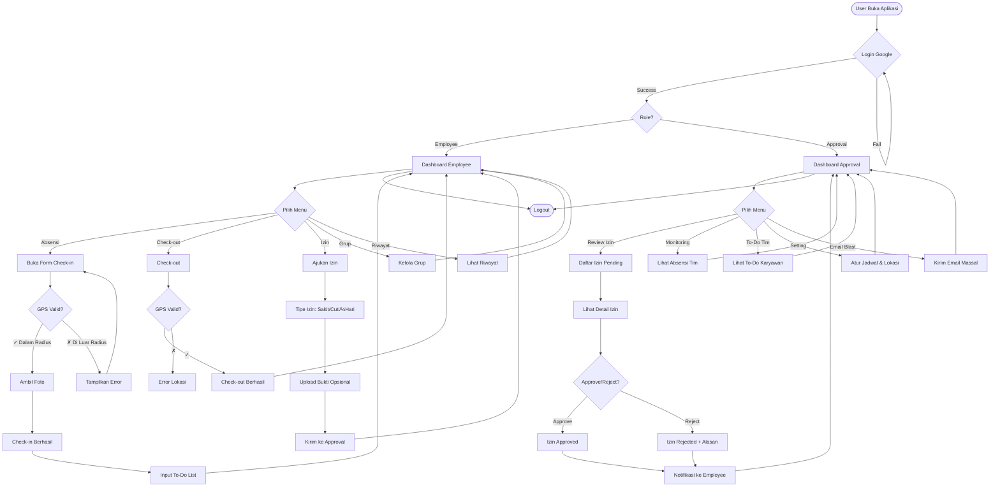
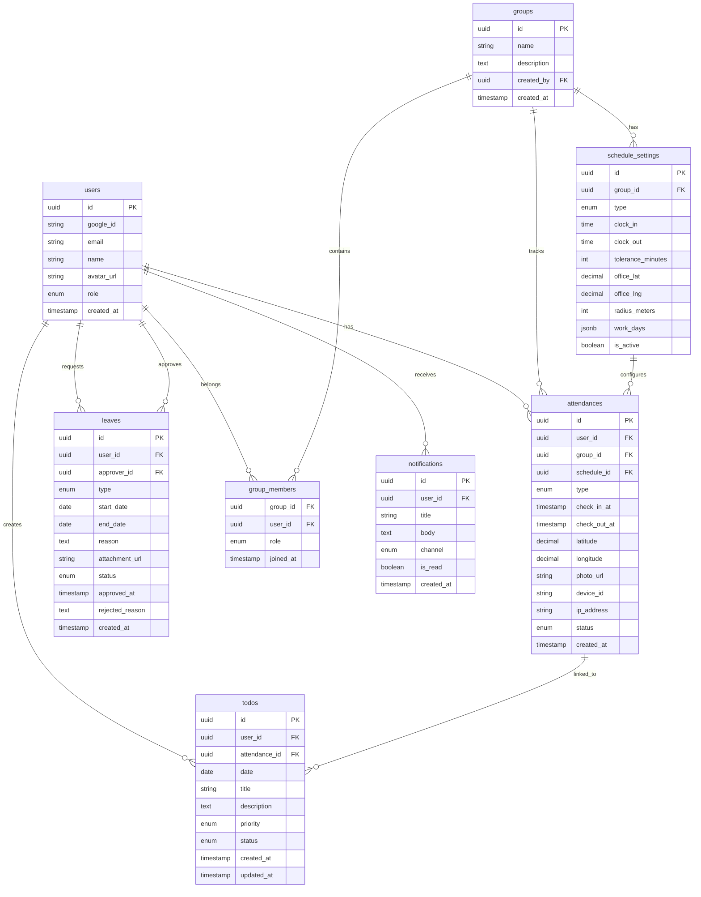
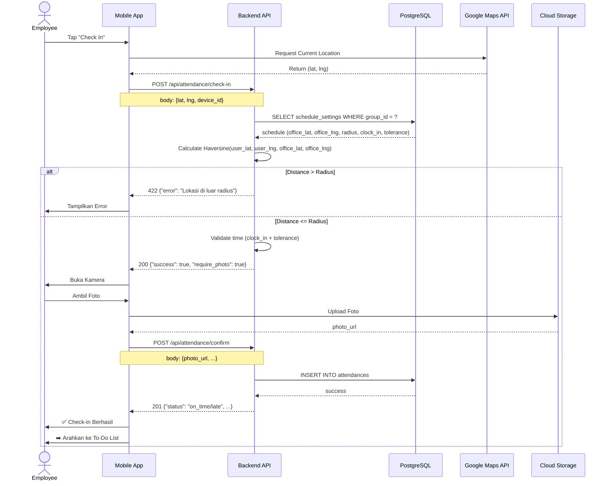
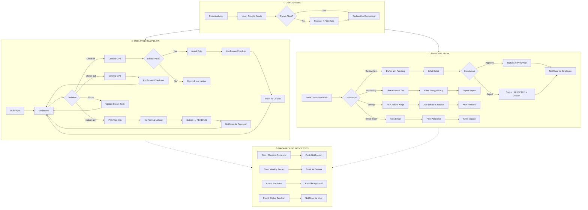

# 📋 PRODUCT REQUIREMENT DOCUMENT (PRD)
## Aplikasi Absensi Digital — "HadirIn"

---

## 1. PROBLEM STATEMENT & GOAL

### Problem Statement
Banyak perusahaan masih menghadapi kendala dalam manajemen kehadiran karyawan, terutama pasca pandemi dengan model kerja hybrid (WFH/WFA). Masalah utamanya:

| No | Masalah | Dampak |
|----|---------|--------|
| 1 | Absensi manual/kertas rentan manipulasi | Data tidak akurat, ghost attendance |
| 2 | Tidak ada verifikasi lokasi real-time | Karyawan tidak bisa diverifikasi posisinya |
| 3 | Proses perizinan masih via chat/WA | Approval lambat, tidak terstruktur, sulit terlacak |
| 4 | Atasan kesulitan memonitor tim | Tidak ada dashboard terpadu |
| 5 | Tidak ada integrasi WFH/WFA | Tidak fleksibel untuk kerja remote |
| 6 | To-do list terpisah dari absensi | Produktivitas tidak terukur harian |

### Goal
Membangun aplikasi absensi digital terintegrasi yang:
- ✅ **Akurat**: Verifikasi lokasi (longitude/latitude) + foto sebagai bukti kehadiran
- ✅ **Fleksibel**: Mendukung WFO, WFH, dan WFA dalam satu sistem
- ✅ **Terstruktur**: Seluruh perizinan terpusat dengan workflow approval
- ✅ **Produktif**: To-do list harian terkoneksi langsung dengan absensi
- ✅ **Terukur**: Dashboard monitoring real-time untuk atasan

---

## 2. PROJECT SCOPE

### In Scope
| Kategori | Cakupan |
|----------|---------|
| **Platform** | Mobile App (Android & iOS) + Web Dashboard Admin |
| **Auth** | Google OAuth 2.0 (Gmail/Google Workspace) |
| **Role** | Employee & Approval (Manager/Supervisor) |
| **Absensi** | Check-in / Check-out dengan geolokasi + foto |
| **Grup** | Buat & kelola grup karyawan |
| **Jadwal** | Setting jam kerja, WFH, WFA, shift |
| **Perizinan** | Sakit, cuti, setengah hari, izin khusus |
| **To-Do List** | Tulis rencana kerja harian setelah absen |
| **Notifikasi** | Email blast + push notification |
| **Laporan** | Riwayat absensi, rekap bulanan |

### Out of Scope
- Payroll / penggajian (bisa jadi modul terpisah)
- Integrasi fingerprint hardware
- Video call / meeting
- Multi-tenant SaaS (untuk v1 fokus single company)

---

## 3. KONSEP & ARSITEKTUR

### High-Level Architecture

```
┌─────────────────────────────────────────────────────────────┐
│                     CLIENT LAYER                            │
│  ┌──────────────────┐  ┌──────────────────┐                 │
│  │  Mobile App       │  │  Web Dashboard   │                 │
│  │  (Flutter/RN)     │  │  (React/Next.js) │                 │
│  └────────┬─────────┘  └────────┬─────────┘                 │
└───────────┼─────────────────────┼───────────────────────────┘
            │                     │
            ▼                     ▼
┌─────────────────────────────────────────────────────────────┐
│                      API GATEWAY                            │
│                  (Kong / Nginx / Cloud)                     │
└─────────────────────────┬───────────────────────────────────┘
                          │
                          ▼
┌─────────────────────────────────────────────────────────────┐
│                    BACKEND SERVICES                         │
│  ┌──────────┐ ┌──────────┐ ┌──────────┐ ┌───────────────┐  │
│  │ Auth     │ │Attendance│ │ Leave    │ │ Notification  │  │
│  │ Service  │ │ Service  │ │ Service  │ │ Service       │  │
│  └────┬─────┘ └────┬─────┘ └────┬─────┘ └───────┬───────┘  │
│       │            │            │               │          │
│  ┌────┴─────┐ ┌────┴─────┐ ┌────┴─────┐ ┌───────┴───────┐  │
│  │ Group    │ │ Schedule │ │ To-Do    │ │ Report        │  │
│  │ Service  │ │ Service  │ │ Service  │ │ Service       │  │
│  └──────────┘ └──────────┘ └──────────┘ └───────────────┘  │
└─────────────────────────┬───────────────────────────────────┘
                          │
          ┌───────────────┼───────────────┐
          ▼               ▼               ▼
┌──────────────┐ ┌──────────────┐ ┌──────────────┐
│  PostgreSQL  │ │    Redis     │ │ Cloud Storage│
│  (Main DB)   │ │   (Cache)    │ │  (Photos)    │
└──────────────┘ └──────────────┘ └──────────────┘
          │
          ▼
┌─────────────────────────────────────────────────────────────┐
│                   EXTERNAL SERVICES                         │
│  ┌──────────────┐ ┌──────────────┐ ┌──────────────┐         │
│  │ Google OAuth │ │ Google Maps  │ │ Email (SMTP/ │         │
│  │ (Sign-In)    │ │ (Geofencing) │ │ SendGrid)    │         │
│  └──────────────┘ └──────────────┘ └──────────────┘         │
└─────────────────────────────────────────────────────────────┘
```

### Tech Stack (Rekomendasi)

| Layer | Teknologi | Alasan |
|-------|-----------|--------|
| **Mobile** | Flutter 3.x | Cross-platform, performa tinggi |
| **Web Dashboard** | Next.js 14 + TailwindCSS | SSR, SEO, cepat |
| **Backend API** | Go (Fiber) / Node.js (NestJS) | Performa, skalabel |
| **Database** | PostgreSQL 15 + PostGIS | Relasional + spasial query |
| **Cache** | Redis | Session, rate limiting |
| **Storage** | Google Cloud Storage | Foto bukti absensi |
| **Auth** | Google OAuth 2.0 + JWT | Integrasi Google sign-in |
| **Maps** | Google Maps Geofencing API | Radius lokasi absensi |
| **Email** | SendGrid / Resend | Email blast notifikasi |
| **CI/CD** | GitHub Actions + Fastlane | Otomasi deployment |
| **Monitoring** | Sentry + Grafana | Error tracking |

---

## 4. FITUR & SPESIFIKASI TEKNIS

### 4.1. Authentication & Role Management

| Spesifikasi | Detail |
|-------------|--------|
| **Login** | Google OAuth 2.0 — `@react-oauth/google` |
| **Token** | JWT (Access 15m + Refresh 7d) |
| **Role** | `EMPLOYEE` dan `APPROVAL` |
| **Onboarding** | Pilih role saat register, approval butuh verifikasi admin |

#### Tabel: `users`
```sql
users (
  id UUID PK,
  google_id VARCHAR UNIQUE,
  email VARCHAR UNIQUE,
  name VARCHAR,
  avatar_url VARCHAR,
  role ENUM('employee','approval'),
  created_at TIMESTAMP
)
```

---

### 4.2. Group Management

| Fitur | Detail |
|-------|--------|
| **Buat Grup** | Nama grup + deskripsi |
| **Add Member** | Cari karyawan via email, invite ke grup |
| **Hapus Member** | Hanya oleh creator/approval |
| **List Grup** | Grup tempat user tergabung |
| **Grup Default** | Setelah dibuat, auto-create grup "Default" |

#### Tabel: `groups`, `group_members`
```sql
groups (
  id UUID PK,
  name VARCHAR,
  description TEXT,
  created_by UUID → users.id,
  created_at TIMESTAMP
)
group_members (
  group_id UUID → groups.id,
  user_id UUID → users.id,
  role ENUM('member','admin'),
  joined_at TIMESTAMP,
  PRIMARY KEY(group_id, user_id)
)
```

---

### 4.3. Work Schedule Settings

| Tipe Jadwal | Deskripsi |
|-------------|-----------|
| 🏢 **WFO** | Work From Office — lokasi kantor tetap |
| 🏠 **WFH** | Work From Home — radius rumah |
| 🌍 **WFA** | Work From Anywhere — lokasi bebas (tetap foto) |

| Setting | Detail |
|---------|--------|
| Jam Masuk | e.g., 08:00 WIB |
| Jam Keluar | e.g., 17:00 WIB |
| Toleransi | e.g., 15 menit (08:15 = terlambat) |
| Lokasi Kantor | Longitude + Latitude + Radius (meter) |
| Hari Kerja | Senin-Jumat / custom |
| Shift | Support multi-shift (pagi/siang/malam) |

#### Tabel: `schedule_settings`
```sql
schedule_settings (
  id UUID PK,
  group_id UUID → groups.id,
  type ENUM('wfo','wfh','wfa'),
  clock_in TIME,
  clock_out TIME,
  tolerance_minutes INT DEFAULT 0,
  office_lat DECIMAL(10,7),
  office_lng DECIMAL(10,7),
  radius_meters INT DEFAULT 100,
  work_days JSONB, -- ["monday","tuesday"...]
  is_active BOOLEAN DEFAULT true
)
```

---

### 4.4. Attendance (Check-in / Check-out)

| Fitur | Spesifikasi |
|-------|-------------|
| **Check-in** | Deteksi lokasi (GPS) → validasi radius → upload foto → catat waktu |
| **Check-out** | Deteksi lokasi → upload foto (opsional) → catat waktu |
| **Validasi Lokasi** | Haversine formula: jarak user ke office ≤ radius |
| **Foto** | Kamera langsung (bukan gallery), timestamp metadata |
| **Anti-Spoofing** | Device ID + IP logging |

#### Flow Validasi Lokasi:
```
GPS User (lat, lng) ──► Haversine(office_lat, office_lng) 
                            │
                    ┌───────▼───────┐
                    │  distance ≤   │
                    │  radius?      │
                    └───┬───────┬───┘
                        │YES    │NO
                        ▼       ▼
                   ✅ SUCCESS  ❌ REJECTED
                              "Lokasi tidak sesuai"
```

#### Tabel: `attendances`
```sql
attendances (
  id UUID PK,
  user_id UUID → users.id,
  group_id UUID → groups.id,
  schedule_id UUID → schedule_settings.id,
  type ENUM('check_in','check_out'),
  check_in_at TIMESTAMP,
  check_out_at TIMESTAMP,
  latitude DECIMAL(10,7),
  longitude DECIMAL(10,7),
  photo_url VARCHAR,
  device_id VARCHAR,
  ip_address VARCHAR,
  status ENUM('on_time','late','early_leave'),
  created_at TIMESTAMP
)
```

---

### 4.5. Permission / Leave Management

| Tipe Izin | Deskripsi | Butuh Bukti |
|-----------|-----------|-------------|
| 🏥 **Sakit** | Izin sakit | Foto surat dokter (opsional) |
| ✈️ **Cuti Tahunan** | Cuti tahunan | Tidak |
| 🕌 **Cuti Khusus** | Ibadah, menikah, duka | Dokumen pendukung |
| 🕐 **Setengah Hari** | Izin ½ hari | Tidak |
| 📝 **Izin Pribadi** | Keperluan pribadi | Tidak |

#### Flow Approval:
```
Employee ──► Ajukan Izin ──► Status: PENDING
                                │
                    ┌───────────▼───────────┐
                    │   Approval Review     │
                    └───┬───────────────┬───┘
                   APPROVE            REJECT
                        │               │
                        ▼               ▼
                   Status:          Status:
                   APPROVED         REJECTED
                        │               │
                        ▼               ▼
              Tercatat di           Notifikasi
              Attendance           ke Employee
```

#### Tabel: `leaves`
```sql
leaves (
  id UUID PK,
  user_id UUID → users.id,
  approver_id UUID → users.id,
  type ENUM('sick','annual','special','half_day','personal'),
  start_date DATE,
  end_date DATE,
  reason TEXT,
  attachment_url VARCHAR,
  status ENUM('pending','approved','rejected'),
  approved_at TIMESTAMP,
  rejected_reason TEXT,
  created_at TIMESTAMP
)
```

---

### 4.6. Daily To-Do List

| Fitur | Detail |
|-------|--------|
| **Input** | Setelah check-in, wajib isi min. 1 task |
| **Task** | Judul + deskripsi + prioritas |
| **Status** | `todo`, `in_progress`, `done`, `blocked` |
| **Visibility** | Approval bisa lihat to-do list anak buahnya |
| **History** | Riwayat to-do per hari |

#### Tabel: `todos`
```sql
todos (
  id UUID PK,
  user_id UUID → users.id,
  attendance_id UUID → attendances.id,
  date DATE,
  title VARCHAR,
  description TEXT,
  priority ENUM('low','medium','high'),
  status ENUM('todo','in_progress','done','blocked'),
  created_at TIMESTAMP,
  updated_at TIMESTAMP
)
```

---

### 4.7. Notification System

| Tipe | Trigger | Channel |
|------|---------|---------|
| **Check-in Reminder** | 30 menit sebelum jam masuk | Push + Email |
| **Check-out Reminder** | 15 menit sebelum jam pulang | Push + Email |
| **Terlambat** | Check-in > toleransi | Push ke Approval |
| **Izin Baru** | Employee ajukan izin | Push + Email ke Approval |
| **Izin Approved/Rejected** | Approval memutuskan | Push + Email ke Employee |
| **Email Blast** | Manual oleh Admin/Approval | Email massal |
| **Weekly Recap** | Setiap Jumat sore | Email |

---

### 🚀 REKOMENDASI FITUR TAMBAHAN (Future Enhancement)

| Fitur | Value | Prioritas |
|-------|-------|-----------|
| 📊 **Dashboard Analytics** | Visualisasi kehadiran, keterlambatan, produktivitas | HIGH |
| 📱 **QR Code Attendance** | Backup absensi saat GPS bermasalah | HIGH |
| 🧮 **Overtime Calculator** | Hitung otomatis jam lembur | MEDIUM |
| 📅 **Calendar Integration** | Sync ke Google Calendar | MEDIUM |
| 📄 **Report Export (PDF/Excel)** | Download rekap absensi bulanan | MEDIUM |
| 🏖️ **Cuti Balance Tracker** | Sisa jatah cuti tahunan | MEDIUM |
| 🔔 **WhatsApp Notification** | Notifikasi via WA Gateway | LOW |
| 🌐 **Multi-language (EN/ID)** | Support bahasa | LOW |
| 🌙 **Dark Mode** | UI theme | LOW |
| 🔐 **Face Recognition** | Anti-spoofing biometrik | LOW |
| 📈 **Leaderboard** | Gamifikasi — karyawan paling rajin | LOW |

---

## 5. DESIGN / MOCKUP

### 5.1. Use Case Diagram (Mermaid)

```mermaid
graph TB
    subgraph "Aplikasi HadirIn - Use Case"
        direction TB
        
        Employee((👤 Employee))
        Approval((👔 Approval))
        
        subgraph "Authentication"
            UC1[Login with Google]
        end
        
        subgraph "Absensi"
            UC2[Check-in dengan GPS & Foto]
            UC3[Check-out dengan GPS]
            UC4[Lihat Riwayat Absensi]
        end
        
        subgraph "Group Management"
            UC5[Buat Grup]
            UC6[Add/Remove Member]
        end
        
        subgraph "Schedule"
            UC7[Setting Jam Kerja]
            UC8[Pilih Mode WFO/WFH/WFA]
        end
        
        subgraph "Perizinan"
            UC9[Ajukan Izin/Cuti]
            UC10[Approve/Reject Izin]
            UC11[Lihat Status Izin]
        end
        
        subgraph "To-Do List"
            UC12[Tulis To-Do Harian]
            UC13[Update Status Task]
            UC14[Lihat To-Do Karyawan]
        end
        
        subgraph "Notification"
            UC15[Kirim Email Blast]
            UC16[Terima Notifikasi]
        end
        
        Employee --> UC1
        Employee --> UC2
        Employee --> UC3
        Employee --> UC4
        Employee --> UC5
        Employee --> UC6
        Employee --> UC9
        Employee --> UC11
        Employee --> UC12
        Employee --> UC13
        Employee --> UC16
        
        Approval --> UC1
        Approval --> UC4
        Approval --> UC7
        Approval --> UC8
        Approval --> UC10
        Approval --> UC14
        Approval --> UC15
        Approval --> UC16
    end
```



---

### 5.2. User Flow Diagram (Mermaid)



---

### 5.3. Database ERD (Mermaid)



---

### 5.4. ASCII WIREFRAME

#### Mobile App — Employee View

```
┌──────────────────────────────────────┐
│  ░░░░░░░░░░░░░░░░░░░░░░░░░░░░░░░░░░  │  ← Status Bar
│  ┌────────────────────────────────┐  │
│  │  HadirIn           🔔  👤     │  │  ← App Bar
│  └────────────────────────────────┘  │
│                                      │
│  ┌────────────────────────────────┐  │
│  │  👋 Selamat Pagi, Budi!       │  │  ← Greeting Card
│  │                                │  │
│  │  📍 WFO - Kantor Pusat        │  │  ← Schedule Mode
│  │  ⏰ 08:00 - 17:00 WIB        │  │
│  │                                │  │
│  │  ┌──────────────────────────┐ │  │
│  │  │     CHECK IN             │ │  │  ← Primary CTA
│  │  │     ⏰ 07:45 WIB         │ │  │
│  │  └──────────────────────────┘ │  │
│  └────────────────────────────────┘  │
│                                      │
│  ┌────────────────────────────────┐  │
│  │  📊 Ringkasan Hari Ini        │  │  ← Quick Stats
│  │  ┌──────┐ ┌──────┐ ┌──────┐  │  │
│  │  │ ✅   │ │ 📋   │ │ 📝   │  │  │
│  │  │Hadir │ │To-Do │ │Izin  │  │  │
│  │  │  22  │ │  3   │ │  0   │  │  │
│  │  └──────┘ └──────┘ └──────┘  │  │
│  └────────────────────────────────┘  │
│                                      │
│  ┌────────────────────────────────┐  │
│  │  📋 To-Do List Hari Ini       │  │  ← To-Do Section
│  │  ┌──────────────────────────┐ │  │
│  │  │ ☐ Review PR #142        │ │  │
│  │  │ ☐ Update API Docs       │ │  │
│  │  │ ☑ Sprint Planning ✅    │ │  │
│  │  └──────────────────────────┘ │  │
│  │  [+ Tambah Task]              │  │
│  └────────────────────────────────┘  │
│                                      │
│  ┌────┬────┬────┬────┬──────────┐    │
│  │ 🏠 │ 📋 │ ➕ │ 📊 │ 👤      │    │  ← Bottom Nav
│  │Home│Todo│Izin│Stat │Profil   │    │
│  └────┴────┴────┴────┴──────────┘    │
└──────────────────────────────────────┘
```

#### Check-in Flow Screen

```
┌──────────────────────────────────────┐
│  ← Kembali     CHECK-IN            │
│                                      │
│  ┌────────────────────────────────┐  │
│  │                                │  │
│  │       📍 Mendeteksi Lokasi     │  │  ← GPS Status
│  │                                │  │
│  │    ┌──────────────────────┐   │  │
│  │    │  🟢 Lokasi Sesuai    │   │  │
│  │    │  Kantor Pusat        │   │  │
│  │    │  Radius: 15m/100m    │   │  │
│  │    │  Lat: -6.2088        │   │  │
│  │    │  Lng: 106.8456       │   │  │
│  │    └──────────────────────┘   │  │
│  │                                │  │
│  └────────────────────────────────┘  │
│                                      │
│  ┌────────────────────────────────┐  │
│  │                                │  │
│  │       📸 Foto Kehadiran        │  │  ← Camera Section
│  │                                │  │
│  │    ┌──────────────────────┐   │  │
│  │    │                      │   │  │
│  │    │    [SELFIE AREA]     │   │  │
│  │    │                      │   │  │
│  │    │    Ambil Foto        │   │  │
│  │    └──────────────────────┘   │  │
│  │                                │  │
│  └────────────────────────────────┘  │
│                                      │
│  ┌────────────────────────────────┐  │
│  │  ⏰ 07:45 WIB - Sen, 20 Jan   │  │  ← Timestamp
│  │  📱 Device: iPhone 15 Pro     │  │
│  └────────────────────────────────┘  │
│                                      │
│  ┌────────────────────────────────┐  │
│  │        ✅ CHECK IN            │  │  ← Submit Button
│  └────────────────────────────────┘  │
└──────────────────────────────────────┘
```

#### Permohonan Izin Screen

```
┌──────────────────────────────────────┐
│  ← Kembali     AJUKAN IZIN         │
│                                      │
│  ┌────────────────────────────────┐  │
│  │  Tipe Izin                     │  │
│  │  ┌──────────────────────────┐  │  │
│  │  │ 🏥 Sakit            ▼   │  │  │  ← Dropdown
│  │  └──────────────────────────┘  │  │
│  └────────────────────────────────┘  │
│                                      │
│  ┌────────────────────────────────┐  │
│  │  📅 Tanggal                    │  │
│  │  ┌────────────┐ ┌───────────┐ │  │
│  │  │ 20/01/2025 │→│21/01/2025 │ │  │  ← Date Range
│  │  └────────────┘ └───────────┘ │  │
│  └────────────────────────────────┘  │
│                                      │
│  ┌────────────────────────────────┐  │
│  │  📝 Alasan                     │  │
│  │  ┌──────────────────────────┐  │  │
│  │  │ Demam dan flu, butuh     │  │  │  ← Text Area
│  │  │ istirahat...             │  │  │
│  │  │                          │  │  │
│  │  └──────────────────────────┘  │  │
│  └────────────────────────────────┘  │
│                                      │
│  ┌────────────────────────────────┐  │
│  │  📎 Lampiran (Opsional)        │  │
│  │  ┌──────────────────────────┐  │  │
│  │  │ 📄 Surat_Dokter.pdf     │  │  │  ← Upload
│  │  │ [+ Tambah Lampiran]     │  │  │
│  │  └──────────────────────────┘  │  │
│  └────────────────────────────────┘  │
│                                      │
│  ┌────────────────────────────────┐  │
│  │       ✈️ KIRIM PERMOHONAN     │  │  ← Submit
│  └────────────────────────────────┘  │
└──────────────────────────────────────┘
```

#### Web Dashboard — Approval View

```
┌──────────────────────────────────────────────────────────────┐
│  HadirIn │ Dashboard │ Tim │ Izin │ Laporan │ ⚙️ │ 👤 Admin │
├──────────────────────────────────────────────────────────────┤
│                                                              │
│  ┌─────────────────────┐ ┌──────────┐ ┌──────────┐ ┌──────┐ │
│  │ 👥 Total Karyawan   │ │ ✅ Hadir │ │ ⏰ Telat │ │ ❌   │ │
│  │       45            │ │   38     │ │    5     │ │Absen │ │
│  │                     │ │          │ │          │ │  2   │ │
│  └─────────────────────┘ └──────────┘ └──────────┘ └──────┘ │
│                                                              │
│  ┌─────────────────────────────────┐ ┌────────────────────┐  │
│  │ 🔔 Permohonan Izin Pending     │ │ 📋 To-Do Tim       │  │
│  │                                 │ │                    │  │
│  │ 🏥 Budi - Sakit        [APPROVE│ │ 🔴 Alice - 0/5     │  │
│  │   20/01 - 21/01        REJECT] │ │ 🟡 Bob - 2/4       │  │
│  │                                 │ │ 🟢 Charlie - 5/5   │  │
│  │ ✈️ Ani - Cuti Tahunan  [APPROVE│ │                    │  │
│  │   22/01 - 24/01        REJECT] │ │                    │  │
│  │                                 │ │                    │  │
│  │ 🕐 Dodi - ½ Hari       [APPROVE│ │                    │  │
│  │   21/01                REJECT] │ │                    │  │
│  └─────────────────────────────────┘ └────────────────────┘  │
│                                                              │
│  ┌──────────────────────────────────────────────────────────┐│
│  │ 📊 Grafik Kehadiran Bulan Ini                           ││
│  │                                                         ││
│  │  ████████████████░░░░ 85% Hadir                        ││
│  │  ████░░░░░░░░░░░░░░░ 10% Izin                          ││
│  │  ██░░░░░░░░░░░░░░░░░  5% Alpa                          ││
│  └──────────────────────────────────────────────────────────┘│
│                                                              │
│  ┌──────────────────────────────────────────────────────────┐│
│  │ 📧 Email Blast                         [Kirim Email]    ││
│  │ ┌────────────────────────────────────────────────────┐  ││
│  │ │ To: [All Employees ▼]  Subject: [Reminder...    ]  │  ││
│  │ └────────────────────────────────────────────────────┘  ││
│  └──────────────────────────────────────────────────────────┘│
└──────────────────────────────────────────────────────────────┘
```

---

### 5.5. Core Technical Flow — Check-in Sequence (Mermaid)



---

### 5.6. Complete App Flow Overview (Mermaid Flowchart)



---

## 📦 SUMMARY — DELIVERABLES CHECKLIST

| # | Komponen | Status |
|---|----------|--------|
| 1 | Problem Statement & Goal | ✅ |
| 2 | Project Scope (In/Out) | ✅ |
| 3 | Konsep & Arsitektur (Diagram + Tech Stack) | ✅ |
| 4 | Fitur & Spesifikasi Teknis (7 modul + tabel SQL) | ✅ |
| 5 | Rekomendasi Fitur Tambahan (11 fitur) | ✅ |
| 6 | Use Case Diagram (Mermaid) | ✅ |
| 7 | User Flow Diagram (Mermaid) | ✅ |
| 8 | Database ERD (Mermaid) | ✅ |
| 9 | Sequence Diagram Check-in (Mermaid) | ✅ |
| 10 | Complete Flowchart (Mermaid) | ✅ |
| 11 | ASCII Wireframe (Mobile 3 screens + Web 1) | ✅ |
| 12 | Spesifikasi API (Check-in sequence) | ✅ |

---

### 🎯 Kesimpulan

**HadirIn** adalah solusi absensi digital all-in-one yang menggabungkan:
- 🔐 **Google OAuth** — tidak perlu daftar manual
- 📍 **Geolokasi + Foto** — mencegah kecurangan absensi
- 🏢🏠🌍 **WFO/WFH/WFA** — fleksibel untuk semua model kerja
- ✅ **Workflow Approval** — perizinan terstruktur dan cepat
- 📋 **To-Do Harian** — produktivitas terukur setiap hari
- 📧 **Email Blast** — komunikasi massal satu klik

PRD ini siap untuk di-breakdown menjadi **User Stories**, **Sprint Planning**, dan **Development Phase**. Untuk tahap selanjutnya bisa langsung saya bantu detailkan API Contract, struktur project frontend/backend, atau setup CI/CD pipeline! 🚀