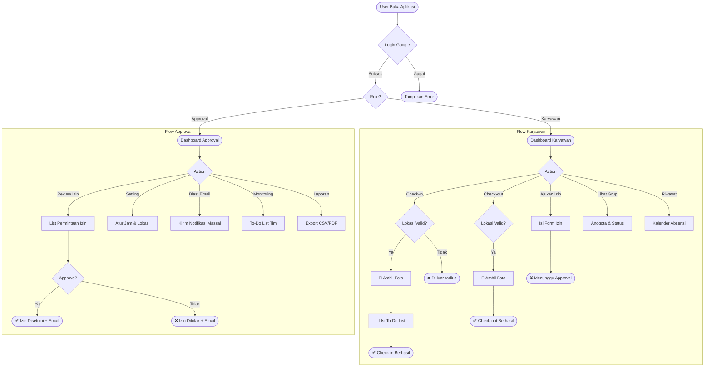
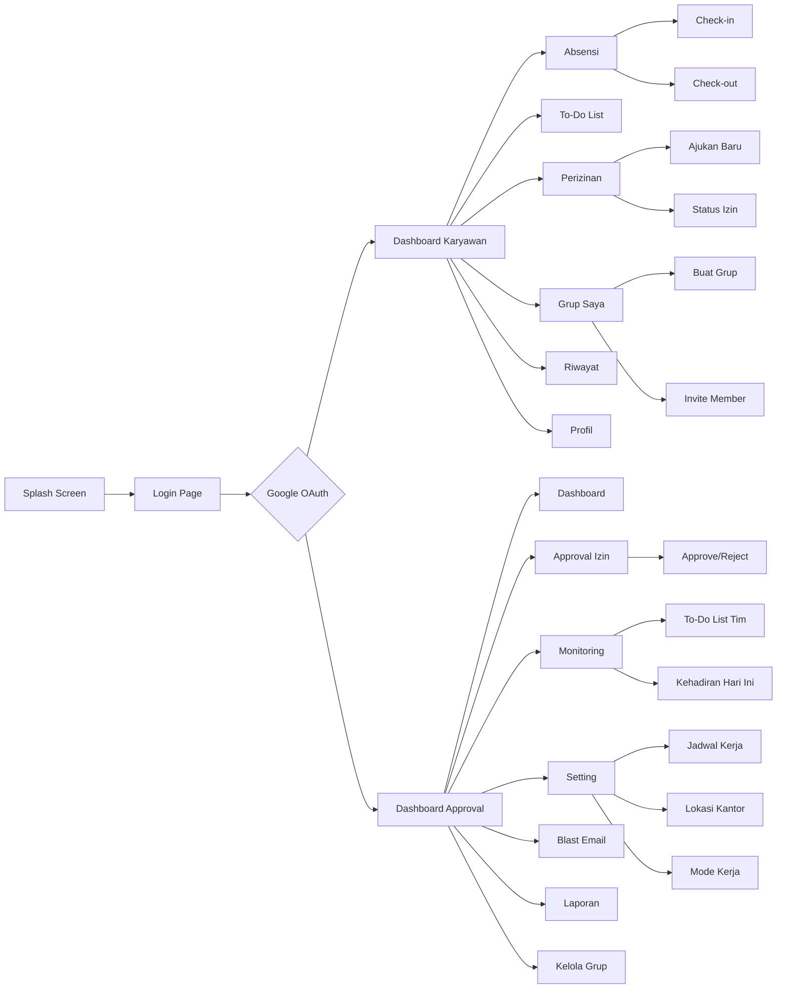
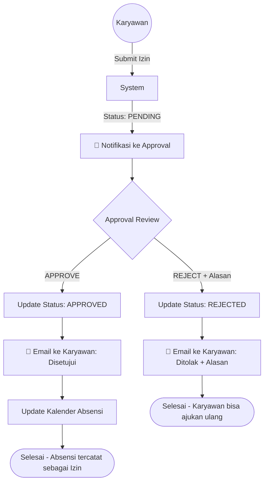
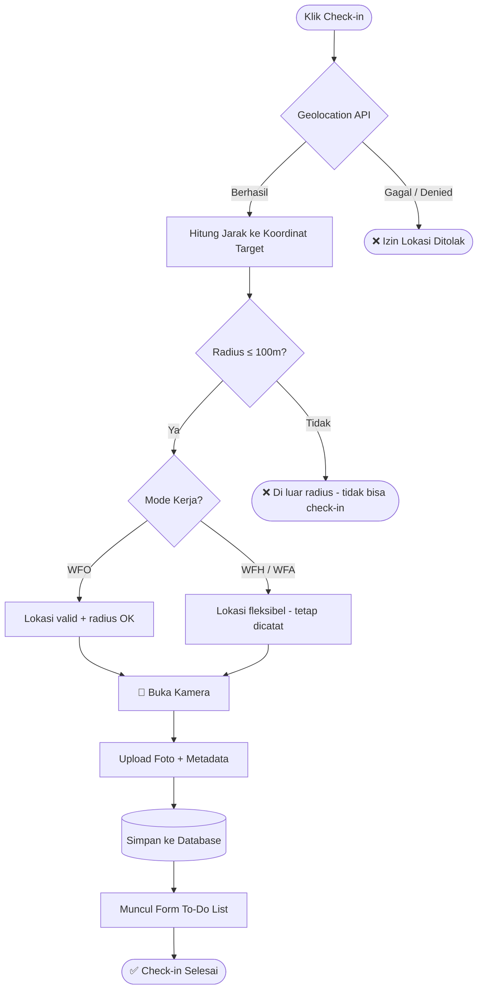
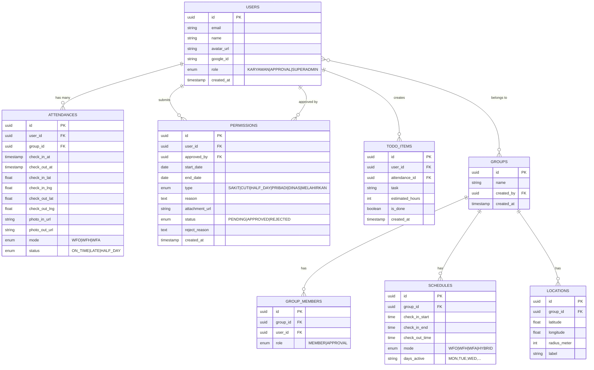

# 📋 PRODUCT REQUIREMENT DOCUMENT (PRD)
## Aplikasi Absensi Digital — "AbsenIn"

---

## 1. PROBLEM STATEMENT & GOAL

### Problem Statement
Banyak perusahaan masih menghadapi kendala dalam manajemen kehadiran karyawan, terutama pasca pandemi dengan model kerja hybrid (WFH/WFA). Masalah utamanya:


| No | Masalah | Dampak |
|----|---------|--------|
| 1 | Proses absensi manual (kertas/tanda tangan) mudah dimanipulasi dan sulit dilacak | Data kehadiran tidak akurat |
| 2 | Tidak ada verifikasi lokasi real-time — karyawan bisa "titip absen" | Kerugian produktivitas perusahaan |
| 3 | Work-from-home (WFH) dan Work-from-anywhere (WFA) sulit dimonitor tanpa sistem terpusat | Manajemen kehadiran kacau |
| 4 | Proses perizinan (cuti/sakit) masih via chat/email — tidak terstruktur dan mudah terlewat | Approval lambat, tidak ada audit trail |
| 5 | Approval harus mengecek satu per satu tanpa dashboard terpadu | Boros waktu dan tidak efisien |
| 6 | Tidak ada integrasi To-Do List dengan absensi — atasan tidak tahu apa yang dikerjakan karyawan | Kurang transparansi kinerja |
| 7 | Notifikasi hanya mengandalkan grup chat — tidak ada sistem blast notifikasi formal | Informasi penting sering terlewat |


### 🎯 Goal

Membangun aplikasi absensi digital berbasis cloud yang **terintegrasi Google OAuth**, mendukung **verifikasi lokasi GPS real-time**, **multi-mode kerja (WFO/WFH/WFA)**, **manajemen grup & perizinan terstruktur**, **daily To-Do List**, dan **notifikasi blast email** — untuk menggantikan absensi manual secara menyeluruh dengan audit trail yang transparan.

---

## 2. PROJECT SCOPE

### ✅ In Scope

| Area | Deskripsi |
|------|-----------|
| **Auth** | Login via Google OAuth 2.0, auto-detect role (Approval / Karyawan) |
| **Role: Karyawan** | Check-in/out GPS, upload foto, To-Do List harian, ajukan izin, gabung grup |
| **Role: Approval** | Dashboard monitoring, approve/reject izin, lihat To-Do List tim, blast notifikasi |
| **Group** | Buat grup, invite member, assign Approval per grup |
| **Jadwal Kerja** | Setting jam masuk/keluar, mode WFO / WFH / WFA / Hybrid |
| **GPS Verification** | Validasi longitude/latitude saat check-in & check-out terhadap koordinat yang di-set |
| **Perizinan** | Izin sakit, cuti, setengah hari, dispensasi, dll — wajib approval |
| **To-Do List** | Wajib diisi setelah check-in, bisa dilihat Approval |
| **Notifikasi Blast** | Kirim email massal ke anggota grup / semua karyawan |
| **Log & History** | Seluruh aktivitas tercatat dengan timestamp |

### ❌ Out of Scope (v1)

- Integrasi payroll / penggajian
- Face recognition AI
- Integrasi fingerprint hardware
- Multi-bahasa (v1: Bahasa Indonesia)
- Aplikasi native iOS/Android (v1: PWA / Web Responsive)
- Slack/Teams integration

---


## 3. KONSEP DAN ARSITEKTUR

### 🏗️ Tech Stack

┌──────────────────────────────────────────────────────────────┐
│                    FRONTEND (PWA)                            │
│                                                              │
│  Next.js + TailwindCSS + shadcn/ui                           │
│  @ducanh2912/next-pwa                                       │
│  Geolocation API + Camera API + Service Worker               │
│                                                              │
│  Mobile-first • Responsive • Installable PWA                │
└───────────────────────────┬──────────────────────────────────┘
                            │
                       REST API / HTTPS
                            │
┌───────────────────────────▼──────────────────────────────────┐
│                     BACKEND API                              │
│                                                              │
│  Express.js + TypeScript + Zod                               │
│  REST API • Business Logic • RBAC                            │
│  GPS Radius Calculation (Haversine)                          │
│  Request / Response Validation                               │
└───────────────────────────┬──────────────────────────────────┘
                            │
                       Drizzle ORM
                            │
┌───────────────────────────▼──────────────────────────────────┐
│                  DATABASE & STORAGE                          │
│                                                              │
│  PostgreSQL (Supabase)                                      │
│  Drizzle ORM + Type-safe Schema                              │
│                                                              │
│  Tables: users, groups, schedules, attendances,              │
│          permissions, todolists, notifications               │
│                                                              │
│  Supabase Storage                                           │
│  → Foto selfie check-in / check-out                         │
│  → Lampiran surat izin                                      │
└───────────────────────────┬──────────────────────────────────┘
                            │
              ┌─────────────┴─────────────┐
              │                           │
┌─────────────▼──────────────┐  ┌─────────▼────────────────┐
│      AUTHENTICATION        │  │     EMAIL SERVICE        │
│                            │  │                           │
│      Google OAuth          │  │       Resend API         │
│      Login & Identity      │  │   Approval Notification  │
│                            │  │      & Email Blast       │
└────────────────────────────┘  └───────────────────────────┘

### 🧱 Arsitektur Sistem
```
### Runtime / model aplikasi (Modular Monolith)

                HADIRIN
                   │
        ┌──────────┴──────────┐
        │                     │
   PWA Frontend          Backend API
   Next.js               Express.js
   Tailwind              TypeScript
   shadcn/ui              Zod
        │                     │
        └──────────┬──────────┘
                   │
             Drizzle ORM
                   │
        ┌──────────┼──────────┐
        │          │          │
   PostgreSQL   Storage    External
   Supabase    Supabase    Services
                          ┌───────┐
                          │ Google│
                          │ OAuth │
                          ├───────┤
                          │Resend │
                          └───────┘

┌──────────┐    ┌──────────────┐    ┌─────────────┐
│  Google  │    │   Frontend   │    │  Email Svc  │
│  OAuth   │◄──►│   (PWA)      │    │ (Resend)    │
└──────────┘    └──────┬───────┘    └──────▲──────┘
                       │                    │
                ┌──────▼───────┐    ┌──────┴──────┐
                │   API GW     │    │  Scheduler  │
                │  (Backend)   │───►│  (Cron)     │
                └──────┬───────┘    └─────────────┘
                       │
          ┌────────────┼────────────┐
          ▼            ▼            ▼
    ┌──────────┐ ┌──────────┐ ┌──────────┐
    │PostgreSQL│ │  Redis   │ │  Cloud   │
    │  (DB)    │ │ (Cache)  │ │ Storage  │
    └──────────┘ └──────────┘ └──────────┘
```

### Repository Monorepo

hadirin/
│
├── apps/
│   ├── web/
│   │   ├── app/
│   │   ├── components/
│   │   ├── lib/
│   │   ├── public/
│   │   ├── styles/
│   │   └── ...
│   │
│   └── api/
│       ├── src/
│       │   ├── modules/
│       │   │   ├── auth/
│       │   │   ├── attendance/
│       │   │   ├── permissions/
│       │   │   ├── todos/
│       │   │   ├── groups/
│       │   │   └── notifications/
│       │   ├── middleware/
│       │   ├── utils/
│       │   ├── app.ts
│       │   └── server.ts
│       └── ...
│
├── packages/
│   ├── db/
│   │   ├── schema/
│   │   ├── relations/
│   │   └── client.ts
│   │
│   ├── shared/
│   │   ├── types/
│   │   ├── constants/
│   │   └── validators/
│   │
│   └── config/
│
├── docs/
│   ├── PRD.md
│   ├── API.md
│   └── architecture/
│
├── .env.example
├── package.json
├── pnpm-workspace.yaml
└── README.md

### 🔐 Authentication Flow

```
User → Klik "Login with Google" → Google OAuth Consent Screen
  → Google returns id_token & access_token
  → Backend verifikasi token → Cek user di DB
  → Jika belum ada: register + assign role default "karyawan"
  → Jika sudah ada: return JWT + role + permissions
  → Frontend redirect ke dashboard sesuai role
```

---

### Tech Stack (Sesuaikan)

| Layer              | Teknologi                           | Peran                                             |
| ------------------ | ----------------------------------- | ------------------------------------------------- |
| **Frontend**       | Next.js + Tailwind CSS + shadcn/ui  | UI PWA mobile-first dan responsive                |
| **PWA Engine**     | `@ducanh2912/next-pwa`              | Service worker, installable app, caching          |
| **Backend API**    | Express.js + TypeScript + Zod       | REST API, business logic, validasi, GPS/Haversine |
| **Database**       | PostgreSQL via Supabase             | Data users, attendance, groups, permissions, todo |
| **ORM**            | Drizzle ORM                         | Query database + type-safe schema                 |
| **Storage**        | Supabase Storage                    | Foto check-in/out dan lampiran izin               |
| **Authentication** | Google OAuth                        | Login dan identitas pengguna                      |
| **Email**          | Resend API                          | Approval email dan blast notification             |
| **Validation**     | Zod                                 | Validasi request/response API                     |
| **Deployment**     | Vercel + Supabase + backend hosting | Frontend, database/storage, dan API               |


---

## 4. FITUR DAN SPESIFIKASI TEKNIS

### 🧩 Core Features

| # | Fitur | Role | Deskripsi Teknis |
|---|-------|------|------------------|
| F1 | Google OAuth Login | All | OAuth 2.0 PKCE flow, verifikasi domain whitelist |
| F2 | Check-in GPS | Karyawan | `navigator.geolocation` → bandingkan radius ≤ 100m dari koordinat tersimpan |
| F3 | Check-out GPS | Karyawan | Sama seperti check-in + hitung total jam kerja |
| F4 | Foto Bukti | Karyawan | Kamera / upload, kompresi client-side ≤ 2MB, simpan ke S3 |
| F5 | Grup Absensi | Karyawan | CRUD grup, invite via email/kode unik, max 50 member/grup |
| F6 | Setting Jadwal | Approval | Jam masuk, jam keluar, toleransi keterlambatan, mode (WFO/WFH/WFA) |
| F7 | Setting Lokasi | Approval | Set koordinat (pin map) + radius toleransi (meter) |
| F8 | Perizinan | Karyawan | Submit izin + dokumen pendukung → status: pending/approved/rejected |
| F9 | Approval Panel | Approval | List izin pending, satu-klik approve/reject + alasan |
| F10 | To-Do List | Karyawan | Wajib isi min. 1 task setelah check-in, editable sepanjang hari |
| F11 | Monitoring To-Do | Approval | Lihat To-Do List semua anggota grup per hari |
| F12 | Blast Email | Approval | Kirim email ke grup / semua, pakai template + variabel |
| F13 | Riwayat Absensi | All | Filter by tanggal, grup, status; export CSV |
| F14 | Dashboard Stats | Approval | Chart kehadiran, keterlambatan, izin per periode |

### 🔧 Spesifikasi Teknis Detail

#### F2/F3 — GPS Check-in/out

```typescript
interface AttendanceCoordinate {
  latitude: number;   // dari setting lokasi
  longitude: number;  // dari setting lokasi
  radiusMeter: number; // default 100m
}

function validateLocation(
  userLat: number, 
  userLng: number, 
  target: AttendanceCoordinate
): boolean {
  // Haversine formula
  const R = 6371000; // meter
  const dLat = (target.latitude - userLat) * Math.PI / 180;
  const dLng = (target.longitude - userLng) * Math.PI / 180;
  const a = Math.sin(dLat/2)**2 + 
            Math.cos(userLat * Math.PI/180) * 
            Math.cos(target.latitude * Math.PI/180) * 
            Math.sin(dLng/2)**2;
  const distance = R * 2 * Math.atan2(Math.sqrt(a), Math.sqrt(1-a));
  return distance <= target.radiusMeter;
}
```

#### F6 — Jadwal Kerja

| Mode | Deskripsi |
|------|-----------|
| **WFO** | Wajib check-in di lokasi kantor (GPS sesuai setting) |
| **WFH** | Check-in dari rumah (lokasi fleksibel, tetap wajib foto) |
| **WFA** | Check-in dari mana saja (GPS tetap tercatat, tidak divalidasi ketat) |
| **Hybrid** | Kombinasi — user pilih mode saat check-in |

---

### 💡 REKOMENDASI FITUR TAMBAHAN

| # | Fitur Tambahan | Nilai Tambah |
|---|----------------|--------------|
| ✨1 | **Auto Check-out Reminder** — notifikasi 15 menit sebelum jam pulang | Kurangi lupa check-out |
| ✨2 | **Leaderboard Kehadiran** — gamifikasi karyawan paling rajin | Boost engagement |
| ✨3 | **QR Code Check-in** — Approval generate QR harian untuk WFO | Anti-titip absen lebih kuat |
| ✨4 | **Overtime Tracker** — otomatis hitung lembur jika checkout > jam kerja | Siap integrasi payroll |
| ✨5 | **Calendar Sync** — sinkron jadwal ke Google Calendar | Visibilitas jadwal tim |
| ✨6 | **Bulk Approval** — approve/reject banyak izin sekaligus | Efisiensi Approval |
| ✨7 | **Daily Recap Email** — auto kirim rekap absensi ke Approval tiap malam | Monitoring pasif |
| ✨8 | **Mode Offline** — bisa check-in tanpa internet, sync saat online | Handal di area minim sinyal |
| ✨9 | **Analytics AI Sederhana** — deteksi anomali pola absensi | Cegah kecurangan |
| ✨10 | **Multi-Level Approval** — hirarki: Manager → Head → HR | Untuk perusahaan besar |

---


## 5. DESIGN / MOCKUP
### Design Style
Design Style
Color Pallete
PRIMARY
Matcha Green      #7FAF8B
Dark Matcha      #527A5B
Soft Matcha      #E8F1E9

BACKGROUND
Warm White       #FAFCF9
Card             #FFFFFF

TEXT
Primary          #1F2937
Secondary        #6B7280

STATUS
Success          #5C9A6F
Warning          #D9A441
Danger           #D96C6C
Info             #6B8FD6

Font
Heading: Plus Jakarta Sans
Body: Inter

UI Style

Style keseluruhan:

Minimal • Modern • Professional • Soft • Clean

Responsive behaviour


### 📊 Use Case Diagram (Mermaid)

```mermaid
graph TD
    subgraph "AbsenIn System"
        A[Google OAuth Login]
    end

    subgraph "Role: Karyawan"
        K1[Check-in dengan GPS]
        K2[Check-out dengan GPS]
        K3[Upload Foto Bukti]
        K4[Buat/Gabung Grup]
        K5[Ajukan Izin / Cuti]
        K6[Isi To-Do List Harian]
        K7[Lihat Riwayat Absensi]
        K8[Lihat Status Izin]
    end

    subgraph "Role: Approval"
        AP1[Dashboard Monitoring Tim]
        AP2[Approve / Reject Izin]
        AP3[Setting Jadwal & Lokasi]
        AP4[Kirim Blast Email]
        AP5[Lihat To-Do List Karyawan]
        AP6[Export Laporan Absensi]
        AP7[Manage Grup & Member]
    end

    KARYAWAN((Karyawan)) --> A
    KARYAWAN --> K1
    KARYAWAN --> K2
    KARYAWAN --> K3
    KARYAWAN --> K4
    KARYAWAN --> K5
    KARYAWAN --> K6
    KARYAWAN --> K7
    KARYAWAN --> K8

    APPROVAL((Approval)) --> A
    APPROVAL --> AP1
    APPROVAL --> AP2
    APPROVAL --> AP3
    APPROVAL --> AP4
    APPROVAL --> AP5
    APPROVAL --> AP6
    APPROVAL --> AP7
    APPROVAL --> K1
    APPROVAL --> K5
```



---

### 🔄 User Flow (Mermaid Flowchart)



---

### 🖥️ App Flow — Sitemap



---

### 📱 ASCII WIREFRAME

#### Screen 1: Login Page

```
┌──────────────────────────────────────┐
│                                      │
│                                      │
│                                      │
│                                      │
│                                      │
│                                      │
│                                      │
│                                      │
│              AbsenIn                 │
│    Smart Attendance System           │
│                                      │
│  ┌────────────────────────────────┐  |
│  │  🔵  Sign in with Google       │  │
│  └────────────────────────────────┘  │
│                                      │
│    By continuing, you agree to       │
│    our Terms & Privacy Policy        │
│                                      │
└──────────────────────────────────────┘
```

#### Screen 2: Dashboard Karyawan

```
┌──────────────────────────────────────┐
│  AbsenIn   🔔  👤 [Nama]            │
├──────────────────────────────────────┤
│                                      │
│  📍 Mode: WFO | Grup: Engineering    │
│                                      │
│  ┌────────────────────────────────┐  │
│  │  ⏰ Selamat Pagi, Budi!        │  │
│  │  Jam Kerja: 08:00 - 17:00     │  │
│  │                                │  │
│  │  🟢 BELUM CHECK-IN            │  │
│  │  ┌──────────────────────┐     │  │
│  │  │   📍 CHECK-IN NOW    │     │  │
│  │  └──────────────────────┘     │  │
│  └────────────────────────────────┘  │
│                                      │
│  ┌──────────────┬──────────────────┐ │
│  │  📋 To-Do    │  📅 Riwayat     │ │
│  │  (3 tasks)   │  22 hari hadir  │ │
│  └──────────────┴──────────────────┘ │
│  ┌──────────────┬──────────────────┐ │
│  │  📝 Izin     │  👥 Grup        │ │
│  │  1 pending   │  Tech Team      │ │
│  └──────────────┴──────────────────┘ │
│                                      │
│  ┌────────────────────────────────┐  │
│  │  📊 Minggu Ini                 │  │
│  │  Sen  ✅  │ Sel ✅  │ Rab  ⏳  │  │
│  │  Kam  —   │ Jum —   │ Sab  —   │  │
│  └────────────────────────────────┘  │
│                                      │
│  [🏠 Home] [📋Todo] [📝Izin] [👤Profil]│
└──────────────────────────────────────┘
```

#### Screen 3: Check-in dengan GPS & Foto

```
┌──────────────────────────────────────┐
│  ◀  Check-in                         │
├──────────────────────────────────────┤
│                                      │
│  📍 Lokasi Terdeteksi                │
│  ┌────────────────────────────────┐  │
│  │  🗺️  [MAP VIEW]               │  │
│  │       ▲ You are here           │  │
│  │    ┌──●──┐                     │  │
│  │    │ 100m│  Radius Kantor      │  │
│  │    └─────┘                     │  │
│  │                                │  │
│  │  ✅ Anda berada dalam radius  │  │
│  │     (34 meter dari kantor)    │  │
│  └────────────────────────────────┘  │
│                                      │
│  📸 Foto Bukti Kehadiran             │
│  ┌────────────────────────────────┐  │
│  │                                │  │
│  │       ┌──────────────┐        │  │
│  │       │              │        │  │
│  │       │   📷 AMBIL   │        │  │
│  │       │    FOTO      │        │  │
│  │       │              │        │  │
│  │       └──────────────┘        │  │
│  └────────────────────────────────┘  │
│                                      │
│  ┌────────────────────────────────┐  │
│  │       ✅ CHECK-IN             │  │
│  │    Pukul: 07:45 WIB           │  │
│  └────────────────────────────────┘  │
│                                      │
└──────────────────────────────────────┘
```

#### Screen 4: To-Do List (Setelah Check-in)

```
┌──────────────────────────────────────┐
│  ◀  To-Do List Hari Ini              │
├──────────────────────────────────────┤
│  📅 Rabu, 15 Januari 2025            │
│                                      │
│  ┌────────────────────────────────┐  │
│  │ ✅  Review PR [#142]           │  │
│  │    ⏰ Estimasi: 2 jam          │  │
│  └────────────────────────────────┘  │
│  ┌────────────────────────────────┐  │
│  │ ⬜  Sprint Planning Meeting    │  │
│  │    ⏰ Estimasi: 1.5 jam        │  │
│  └────────────────────────────────┘  │
│  ┌────────────────────────────────┐  │
│  │ ⬜  Bug Fix: Login Issue #89   │  │
│  │    ⏰ Estimasi: 3 jam          │  │
│  └────────────────────────────────┘  │
│                                      │
│  ┌────────────────────────────────┐  │
│  │  + Tambah Task Baru            │  │
│  └────────────────────────────────┘  │
│                                      │
│  ┌────────────────────────────────┐  │
│  │       💾 SIMPAN               │  │
│  └────────────────────────────────┘  │
└──────────────────────────────────────┘
```
#### Screen 5: Perizinan

```

```
┌──────────────────────────────────────┐
│  ← Kembali     AJUKAN IZIN         │
│                                      │
│  ┌────────────────────────────────┐  │
│  │  Tipe Izin                     │  │
│  │  ┌──────────────────────────┐  │  │
│  │  │ 🏥 Sakit            ▼   │  │  │  ← Dropdown
│  │  └──────────────────────────┘  │  │
│  └────────────────────────────────┘  │
│                                      │
│  ┌────────────────────────────────┐  │
│  │  📅 Tanggal                    │  │
│  │  ┌────────────┐ ┌───────────┐ │  │
│  │  │ 20/01/2025 │→│21/01/2025 │ │  │  ← Date Range
│  │  └────────────┘ └───────────┘ │  │
│  └────────────────────────────────┘  │
│                                      │
│  ┌────────────────────────────────┐  │
│  │  📝 Alasan                     │  │
│  │  ┌──────────────────────────┐  │  │
│  │  │ Demam dan flu, butuh     │  │  │  ← Text Area
│  │  │ istirahat...             │  │  │
│  │  │                          │  │  │
│  │  └──────────────────────────┘  │  │
│  └────────────────────────────────┘  │
│                                      │
│  ┌────────────────────────────────┐  │
│  │  📎 Lampiran (Opsional)        │  │
│  │  ┌──────────────────────────┐  │  │
│  │  │ 📄 Surat_Dokter.pdf     │  │  │  ← Upload
│  │  │ [+ Tambah Lampiran]     │  │  │
│  │  └──────────────────────────┘  │  │
│  └────────────────────────────────┘  │
│                                      │
│  ┌────────────────────────────────┐  │
│  │       ✈️ KIRIM PERMOHONAN     │  │  ← Submit
│  └────────────────────────────────┘  │
└──────────────────────────────────────┘
```


#### Screen 6: Dashboard Approval

```
┌──────────────────────────────────────┐
│  AbsenIn    🔔  👤 [Manager]         │
├──────────────────────────────────────┤
│                                      │
│  📊 Ringkasan Hari Ini               │
│  ┌──────────┬──────────┬───────────┐ │
│  │ 👥 Hadir │ ⏰ Telat │ ❌ Absen  │ │
│  │   12     │    2     │    3      │ │
│  └──────────┴──────────┴───────────┘ │
│                                      │
│  ⚠️ Pending Approval (5)             │
│  ┌────────────────────────────────┐  │
│  │ 🟡 Budi - Cuti Tahunan         │  │
│  │    15-16 Jan · 2 hari          │  │
│  │    [✓ Approve] [✗ Reject]      │  │
│  ├────────────────────────────────┤  │
│  │ 🟡 Siti - Izin Sakit           │  │
│  │    15 Jan · 1 hari             │  │
│  │    📎 [Lihat Surat Dokter]     │  │
│  │    [✓ Approve] [✗ Reject]      │  │
│  ├────────────────────────────────┤  │
│  │ 🟡 ...3 lainnya                │  │
│  └────────────────────────────────┘  │
│                                      │
│  📋 Quick Actions                    │
│  [📧 Blast] [⚙️ Setting] [📊 Report]│
│                                      │
│  [🏠 Home] [✅Apprv] [👥Tim] [⚙️Set] │
└──────────────────────────────────────┘
```

---

### 📊 Flowchart: Approval Process (Mermaid)



---

### 📊 Flowchart: Check-in/out dengan GPS (Mermaid)



---

### 🗄️ Database Schema (Simplified)



---


---

### 📋 Ringkasan API Endpoints

| Method | Endpoint | Role | Deskripsi |
|--------|----------|------|-----------|
| `POST` | `/api/auth/google` | All | Login/register via Google |
| `POST` | `/api/attendance/checkin` | Karyawan | Check-in + GPS + foto |
| `POST` | `/api/attendance/checkout` | Karyawan | Check-out + GPS + foto |
| `GET`  | `/api/attendance/history` | All | Riwayat absensi (filterable) |
| `POST` | `/api/permissions` | Karyawan | Ajukan izin baru |
| `GET`  | `/api/permissions` | All | List izin (by role) |
| `PUT`  | `/api/permissions/:id` | Approval | Approve / reject izin |
| `POST` | `/api/todos` | Karyawan | Tambah To-Do |
| `GET`  | `/api/todos/user/:id` | Approval | Lihat To-Do karyawan |
| `POST` | `/api/groups` | Karyawan | Buat grup |
| `POST` | `/api/groups/:id/invite` | Approval | Invite member |
| `PUT`  | `/api/settings/schedule` | Approval | Atur jadwal |
| `PUT`  | `/api/settings/location` | Approval | Atur lokasi |
| `POST` | `/api/notifications/blast` | Approval | Kirim blast email |
| `GET`  | `/api/dashboard/stats` | Approval | Statistik dashboard |

---


### 🔔 Notifikasi Blast — Spesifikasi

```
┌─────────────────────────────────────────────┐
│           FLOW BLAST EMAIL                  │
│                                             │
│  Approval → Pilih Penerima:                 │
│    ○ Semua Karyawan                         │
│    ● Per Grup: [Engineering ▼]             │
│    ○ Custom Selection                       │
│                                             │
│  Template:                                  │
│    📝 Subject:  _____________________       │
│    📝 Body:     _____________________       │
│                (Rich Text / Markdown)       │
│                                             │
│  Variabel yang bisa dipakai:                │
│    {{name}} - Nama penerima                 │
│    {{group}} - Nama grup                    │
│    {{date}}  - Tanggal hari ini             │
│                                             │
│  [📨 Kirim Sekarang]  [💾 Simpan Draft]    │
│                                             │
│  Log: 45/50 terkirim, 5 gagal              │
└─────────────────────────────────────────────┘
```

---

## 📦 Deliverables Checklist

| Item | Status |
|------|--------|
| Problem Statement & Goal | ✅ |
| Project Scope (In/Out) | ✅ |
| Konsep & Arsitektur (Tech Stack + Diagram) | ✅ |
| Fitur Utama + Spesifikasi Teknis | ✅ |
| Rekomendasi Fitur Tambahan (10 fitur) | ✅ |
| Use Case Diagram (Mermaid) | ✅ |
| User Flow (Mermaid Flowchart) | ✅ |
| App Flow / Sitemap (Mermaid) | ✅ |
| ASCII Wireframe (6 screen) | ✅ |
| Approval Flowchart (Mermaid) | ✅ |
| GPS Check-in Flowchart (Mermaid) | ✅ |
| Database ERD (Mermaid) | ✅ |
| API Endpoints List | ✅ |
| Blast Email Spesifikasi | ✅ |

---
