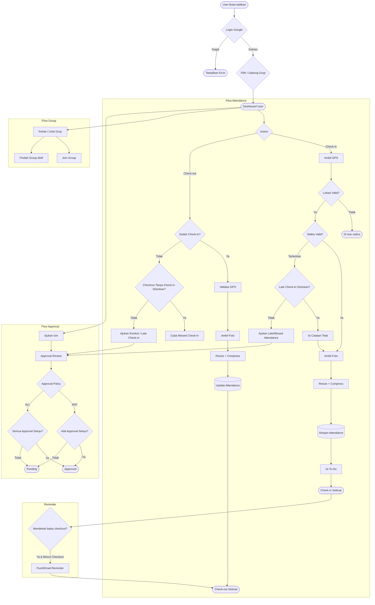
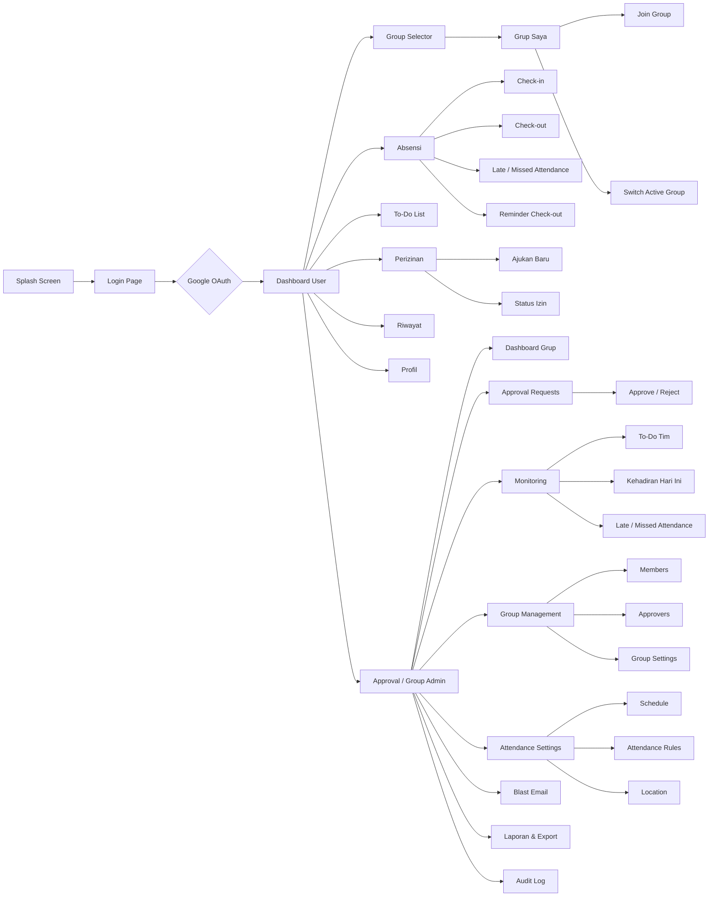
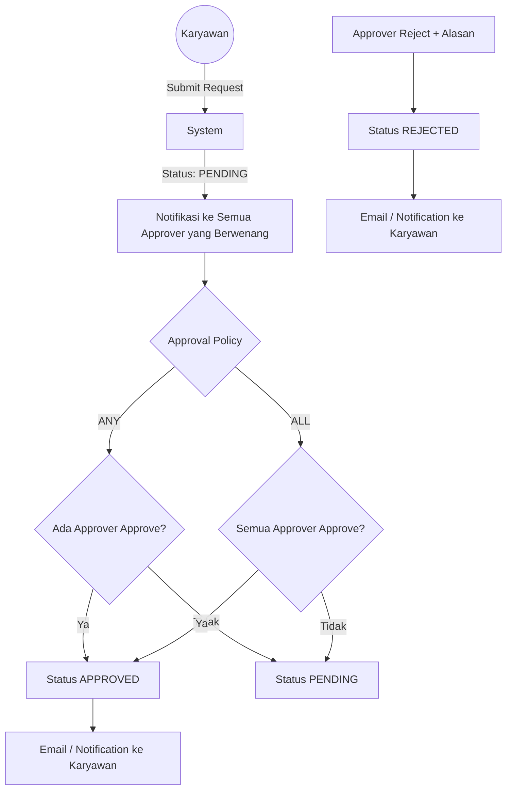
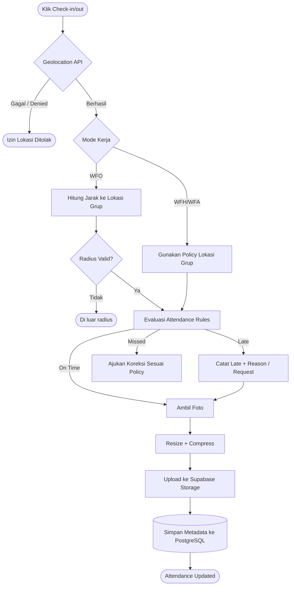

# 📋 PRODUCT REQUIREMENT DOCUMENT (PRD)
## Aplikasi Absensi Digital — "AbsenIn"

---

## 1. PROBLEM STATEMENT & GOAL

### Problem Statement

AbsenIn dirancang sebagai aplikasi absensi digital yang dapat digunakan secara fleksibel oleh berbagai organisasi, tim, komunitas, maupun kelompok kerja. Sistem perlu menangani kebutuhan absensi yang berbeda antar-grup tanpa membuat aturan absensi menjadi terlalu kaku. Masalah utama yang ingin diselesaikan:

| No | Masalah | Dampak |
|----|---------|--------|
| 1 | Proses absensi manual mudah dimanipulasi dan sulit dilacak | Data kehadiran tidak akurat |
| 2 | Tidak ada verifikasi lokasi real-time | Risiko titip absen dan validasi lokasi yang lemah |
| 3 | Setiap grup dapat memiliki jadwal, lokasi, dan aturan absensi yang berbeda | Sistem sulit digunakan untuk banyak tipe organisasi |
| 4 | User dapat menjadi anggota lebih dari satu grup | Struktur membership tidak fleksibel jika hanya mendukung satu grup |
| 5 | Approval hanya ditangani satu orang | Bottleneck pada proses persetujuan |
| 6 | Pengelolaan grup besar belum memiliki pengaturan dan hak akses yang jelas | Sulit melakukan administrasi anggota dan konfigurasi grup |
| 7 | User dapat lupa melakukan check-out | Data kehadiran menjadi tidak lengkap |
| 8 | Batas waktu check-in/check-out tidak memiliki mekanisme penanganan keterlambatan yang fleksibel | User tidak memiliki jalur yang jelas ketika terlambat atau lupa absensi |
| 9 | Foto dari kamera ponsel berukuran besar | Upload lambat dan penggunaan storage meningkat |
| 10 | Perizinan dilakukan melalui chat/email | Approval lambat dan audit trail tidak terstruktur |

### 🎯 Goal

Membangun **AbsenIn sebagai platform absensi digital yang generic, configurable, dan berbasis cloud**, dengan dukungan multi-group membership, multiple approval, verifikasi GPS, foto bukti yang dikompresi, aturan waktu absensi per grup, penanganan check-in terlambat/missed attendance, reminder check-out, perizinan terstruktur, daily To-Do List, dan audit trail.

Setiap grup dapat memiliki konfigurasi sendiri, sementara satu pengguna dapat bergabung pada beberapa grup sesuai hak akses yang dimilikinya.

---

## 2. PROJECT SCOPE

### ✅ In Scope

| Area | Deskripsi |
|------|-----------|
| **Auth** | Login via Google OAuth 2.0 dan identitas pengguna |
| **User** | Satu user dapat menjadi anggota banyak grup |
| **Role** | KARYAWAN, APPROVAL, dan SUPERADMIN dengan hak akses berbasis konteks grup |
| **Role: Karyawan** | Check-in/out GPS, foto bukti, To-Do List, pengajuan izin, dan bergabung dengan grup |
| **Role: Approval** | Monitoring anggota pada grup yang menjadi tanggung jawabnya, approval izin, pengelolaan konfigurasi sesuai permission, dan blast notification |
| **Group** | Create, read, update, delete group; invite/join member; pengelolaan member; pengaturan approval per grup |
| **Multiple Approval** | Satu grup dapat memiliki banyak Approval dengan policy approval yang dapat dikonfigurasi |
| **Jadwal Kerja** | Jadwal dan jam absensi dapat dikonfigurasi per grup |
| **Attendance Rules** | Batas waktu check-in/out, toleransi keterlambatan, aturan missed check-in/check-out, dan kebijakan late check-in |
| **Work Mode** | WFO / WFH / WFA / Hybrid sesuai konfigurasi grup |
| **GPS Verification** | Validasi latitude/longitude terhadap lokasi grup sesuai mode kerja |
| **Foto Bukti** | Kamera/upload, validasi ukuran/format, resize dan compression sebelum storage |
| **Perizinan** | Izin sakit, cuti, setengah hari, dispensasi, dinas, dll. dengan approval |
| **To-Do List** | Task harian setelah check-in dan monitoring oleh Approval |
| **Reminder** | Reminder otomatis untuk user yang belum check-out |
| **Notifikasi** | Notifikasi approval, reminder attendance, dan blast email |
| **Log & History** | Seluruh aktivitas penting tercatat dengan timestamp |

### ❌ Out of Scope (v1)

- Integrasi payroll / penggajian
- Face recognition AI
- Integrasi fingerprint hardware
- Multi-bahasa
- Aplikasi native iOS/Android (v1: PWA / Web Responsive)
- Slack/Teams integration
- Perhitungan payroll/lembur untuk kebutuhan penggajian
- Multi-level approval kompleks seperti Manager → Head → HR; v1 menggunakan multiple approver dalam satu grup dengan policy sederhana

---

## 3. KONSEP DAN ARSITEKTUR

### 🏗️ Tech Stack

┌──────────────────────────────────────────────────────────────┐
│                    FRONTEND (PWA)                            │
│                                                              │
│  Next.js + TailwindCSS + shadcn/ui                           │
│  @ducanh2912/next-pwa                                       │
│  Geolocation API + Camera API + Service Worker               │
│                                                              │
│  Mobile-first • Responsive • Installable PWA                │
└───────────────────────────┬──────────────────────────────────┘
                            │
                       REST API / HTTPS
                            │
┌───────────────────────────▼──────────────────────────────────┐
│                     BACKEND API                              │
│                                                              │
│  Express.js + TypeScript + Zod                               │
│  REST API • Business Logic • RBAC                            │
│  GPS Radius Calculation (Haversine)                          │
│  Request / Response Validation                               │
└───────────────────────────┬──────────────────────────────────┘
                            │
                       Drizzle ORM
                            │
┌───────────────────────────▼──────────────────────────────────┐
│                  DATABASE & STORAGE                          │
│                                                              │
│  PostgreSQL (Supabase)                                      │
│  Drizzle ORM + Type-safe Schema                              │
│                                                              │
│  Tables: users, groups, schedules, attendances,              │
│          permissions, todolists, notifications               │
│                                                              │
│  Supabase Storage                                           │
│  → Foto selfie check-in / check-out                         │
│  → Lampiran surat izin                                      │
└───────────────────────────┬──────────────────────────────────┘
                            │
              ┌─────────────┴─────────────┐
              │                           │
┌─────────────▼──────────────┐  ┌─────────▼────────────────┐
│      AUTHENTICATION        │  │     EMAIL SERVICE        │
│                            │  │                           │
│      Google OAuth          │  │       Resend API         │
│      Login & Identity      │  │   Approval Notification  │
│                            │  │      & Email Blast       │
└────────────────────────────┘  └───────────────────────────┘

### 🧱 Arsitektur Sistem
```
### Runtime / model aplikasi (Modular Monolith)

                HADIRIN
                   │
        ┌──────────┴──────────┐
        │                     │
   PWA Frontend          Backend API
   Next.js               Express.js
   Tailwind              TypeScript
   shadcn/ui              Zod
        │                     │
        └──────────┬──────────┘
                   │
             Drizzle ORM
                   │
        ┌──────────┼──────────┐
        │          │          │
   PostgreSQL   Storage    External
   Supabase    Supabase    Services
                          ┌───────┐
                          │ Google│
                          │ OAuth │
                          ├───────┤
                          │Resend │
                          └───────┘

┌──────────┐    ┌──────────────┐    ┌─────────────┐
│  Google  │    │   Frontend   │    │  Email Svc  │
│  OAuth   │◄──►│   (PWA)      │    │ (Resend)    │
└──────────┘    └──────┬───────┘    └──────▲──────┘
                       │                    │
                ┌──────▼───────┐    ┌──────┴──────┐
                │   API GW     │    │  Scheduler  │
                │  (Backend)   │───►│  (Cron)     │
                └──────┬───────┘    └─────────────┘
                       │
          ┌────────────┼────────────┐
          ▼            ▼            ▼
    ┌──────────┐ ┌──────────┐ ┌──────────┐
    │PostgreSQL│ │  Redis   │ │  Cloud   │
    │  (DB)    │ │ (Cache)  │ │ Storage  │
    └──────────┘ └──────────┘ └──────────┘
```

### Repository Monorepo

hadirin/
│
├── apps/
│   ├── web/
│   │   ├── app/
│   │   ├── components/
│   │   ├── lib/
│   │   ├── public/
│   │   ├── styles/
│   │   └── ...
│   │
│   └── api/
│       ├── src/
│       │   ├── modules/
│       │   │   ├── auth/
│       │   │   ├── attendance/
│       │   │   ├── permissions/
│       │   │   ├── todos/
│       │   │   ├── groups/
│       │   │   └── notifications/
│       │   ├── middleware/
│       │   ├── utils/
│       │   ├── app.ts
│       │   └── server.ts
│       └── ...
│
├── packages/
│   ├── db/
│   │   ├── schema/
│   │   ├── relations/
│   │   └── client.ts
│   │
│   ├── shared/
│   │   ├── types/
│   │   ├── constants/
│   │   └── validators/
│   │
│   └── config/
│
├── docs/
│   ├── PRD.md
│   ├── API.md
│   └── architecture/
│
├── .env.example
├── package.json
├── pnpm-workspace.yaml
└── README.md

### 🔐 Authentication Flow

```
User → Klik "Login with Google" → Google OAuth Consent Screen
  → Google returns id_token & access_token
  → Backend verifikasi token → Cek user di DB
  → Jika belum ada: register + assign role default "karyawan"
  → Jika sudah ada: return JWT + role + permissions
  → Frontend redirect ke dashboard sesuai role
```

---

### Tech Stack (Sesuaikan)

| Layer              | Teknologi                           | Peran                                             |
| ------------------ | ----------------------------------- | ------------------------------------------------- |
| **Frontend**       | Next.js + Tailwind CSS + shadcn/ui  | UI PWA mobile-first dan responsive                |
| **PWA Engine**     | `@ducanh2912/next-pwa`              | Service worker, installable app, caching          |
| **Backend API**    | Express.js + TypeScript + Zod       | REST API, business logic, validasi, GPS/Haversine |
| **Database**       | PostgreSQL via Supabase             | Data users, attendance, groups, permissions, todo |
| **ORM**            | Drizzle ORM                         | Query database + type-safe schema                 |
| **Storage**        | Supabase Storage                    | Foto check-in/out dan lampiran izin               |
| **Image Processing**| Client-side resize/compression + server validation | Mengurangi ukuran foto sebelum upload             |
| **Scheduler**       | Cron / scheduled job                | Reminder check-out dan proses attendance terjadwal |
| **Authentication** | Google OAuth                        | Login dan identitas pengguna                      |
| **Email**          | Resend API                          | Approval email dan blast notification             |
| **Validation**     | Zod                                 | Validasi request/response API                     |
| **Deployment**     | Vercel + Supabase + backend hosting | Frontend, database/storage, dan API               |


---

## 4. FITUR DAN SPESIFIKASI TEKNIS

### 🧩 Core Features

| # | Fitur | Role | Deskripsi Teknis |
|---|-------|------|------------------|
| F1 | Google OAuth Login | All | OAuth 2.0 PKCE, login/register, identitas user, dan session management |
| F2 | Check-in GPS | Karyawan | `navigator.geolocation` → validasi radius berdasarkan konfigurasi grup |
| F3 | Check-out GPS | Karyawan | Validasi lokasi sesuai aturan grup + hitung durasi kerja |
| F4 | Foto Bukti + Compression | Karyawan | Kamera/upload → resize/compress → validasi format/ukuran → Supabase Storage |
| F5 | Multi-Group Membership | All | User dapat bergabung pada banyak grup melalui invite/kode/link |
| F6 | Group Management | Group Admin/Approval sesuai permission | CRUD grup, member, role, invitation, dan konfigurasi grup |
| F7 | Multiple Approval | Approval | Satu grup dapat memiliki banyak Approval; policy dapat berupa ANY atau ALL |
| F8 | Setting Jadwal & Attendance Rules | Group Admin/Approval sesuai permission | Jam kerja, batas check-in/out, toleransi telat, dan aturan missed attendance |
| F9 | Setting Lokasi | Group Admin/Approval sesuai permission | Koordinat, label lokasi, radius, dan keterkaitan dengan mode kerja |
| F10 | Perizinan | Karyawan + Approval | Submit izin → multiple approval → approved/rejected dengan audit trail |
| F11 | Late / Missed Check-in Handling | Karyawan + Approval | User dapat melakukan late check-in dengan catatan atau mengajukan koreksi/approval sesuai policy grup |
| F12 | Auto Check-out Reminder | System + Karyawan | Reminder otomatis jika user sudah check-in tetapi belum check-out |
| F13 | To-Do List | Karyawan | Wajib isi minimal 1 task setelah check-in, editable sepanjang hari |
| F14 | Monitoring To-Do & Attendance | Approval | Monitoring anggota grup berdasarkan tanggal/status |
| F15 | Blast Email | Approval | Kirim email ke grup/anggota dengan template dan variabel |
| F16 | Riwayat Absensi | All | Filter tanggal, grup, status, mode kerja; export |
| F17 | Dashboard Stats | Approval | Statistik kehadiran, keterlambatan, izin, missed check-out per grup/periode |
| F18 | Audit Log | Approval/SUPERADMIN | Catat perubahan konfigurasi, approval, attendance correction, dan aktivitas administratif |

### 🔧 Attendance Rules

Aturan attendance tidak dibuat global. Setiap grup dapat memiliki konfigurasi sendiri.

Contoh konfigurasi:

```text
Attendance Rules
├── check_in_start       : 07:00
├── check_in_deadline    : 09:00
├── check_out_start      : 16:00
├── check_out_deadline   : 23:59
├── late_tolerance       : 15 minutes
├── allow_late_checkin   : true
├── require_late_reason  : true
├── allow_checkout_without_checkin : configurable
└── reminder_before_checkout : 15 minutes
```

### ⏰ Check-in Policy

Sistem tidak langsung menolak user setelah batas check-in. Perilaku ditentukan oleh konfigurasi grup.

```text
User belum check-in
        │
        ▼
Klik CHECK-IN
        │
        ├── Dalam window check-in
        │       ↓
        │    ON_TIME
        │
        └── Setelah deadline
                ↓
        allow_late_checkin?
             │          │
            Ya         Tidak
             │          │
             ▼          ▼
       LATE + reason   Missed Check-in
```

Jika late check-in diperbolehkan, sistem mencatat waktu aktual dan alasan keterlambatan. Jika memerlukan approval, attendance dapat berstatus `PENDING_CORRECTION` sampai disetujui.

### 🔚 Missed Check-in / Check-out

Jika user belum melakukan check-in tetapi mencoba melakukan check-out, sistem menampilkan opsi sesuai policy grup:

```text
Belum Check-in
      ↓
Klik Check-out
      ↓
System Warning
      ├── Check-in Sekarang
      ├── Ajukan Late/Missed Check-in
      └── Batal
```

Sistem tidak boleh membuat data check-out tanpa aturan yang jelas. Jika grup mengizinkan checkout tanpa check-in, status attendance harus tetap menandai kondisi tersebut agar dapat ditinjau Approval.

Jika user sudah check-in tetapi melewati waktu check-out tanpa melakukan checkout:

```text
CHECK-IN ✓
    ↓
Mendekati jam checkout
    ↓
Reminder
    ↓
Belum checkout?
    ↓
MISSED_CHECKOUT
```

Status `MISSED_CHECKOUT` dapat digunakan oleh sistem untuk menampilkan notifikasi dan, jika dikonfigurasi, membuka mekanisme koreksi attendance.

### 📸 Photo Compression

Foto attendance diproses sebelum disimpan ke Supabase Storage.

```text
Camera / Upload
      ↓
Validate MIME type
      ↓
Resize image
      ↓
Compress image
      ↓
Target ≤ 2 MB
      ↓
WebP / JPEG
      ↓
Upload Supabase Storage
      ↓
Simpan storage key/URL di database
```

Rekomendasi default: dimensi maksimum 1280 px pada sisi terpanjang dan target ukuran file maksimal 2 MB. Backend tetap melakukan validasi ukuran dan MIME type meskipun compression dilakukan di client.

### 👥 Multi-Group & Multiple Approval

Satu user dapat memiliki membership pada beberapa grup. Role user harus dipahami berdasarkan konteks membership grup, bukan hanya satu role global.

Contoh:

```text
User A
├── Group Engineering → MEMBER
├── Group Event → APPROVAL
└── Group Research → MEMBER
```

Satu grup dapat memiliki banyak Approval:

```text
Group Engineering
├── Approval A
├── Approval B
└── Approval C
```

Approval policy minimal v1:

- `ANY`: salah satu Approval menyetujui → request approved.
- `ALL`: seluruh Approval yang ditentukan harus menyetujui → request approved.

### 🛠️ Group Settings & Permission

Group memiliki pengaturan sendiri untuk: member, Approval, schedule, attendance rules, location, dan permission workflow.

Hak akses harus mendukung operasi CRUD sesuai kewenangan:

```text
GROUP
├── General
├── Members
│   ├── Add
│   ├── Remove
│   └── Change Membership Role
├── Approvers
├── Schedule
├── Attendance Rules
├── Locations
└── Permission Policy
```

Untuk grup besar, operasi administratif harus menggunakan pagination/search/filter agar tidak bergantung pada daftar anggota yang dimuat sekaligus.

### 🧱 Work Mode

| Mode | Deskripsi |
|------|-----------|
| **WFO** | Wajib check-in/out dalam radius lokasi yang dikonfigurasi |
| **WFH** | Lokasi fleksibel sesuai kebijakan grup, foto tetap wajib |
| **WFA** | Lokasi dicatat tetapi validasi radius dapat dinonaktifkan |
| **Hybrid** | User memilih mode yang tersedia pada jadwal/grup |

---

### 💡 Fitur Tambahan yang Diprioritaskan

| # | Fitur | Prioritas | Nilai Tambah |
|---|-------|-----------|--------------|
| 1 | **Auto Check-out Reminder** | P0 | Mengurangi lupa check-out |
| 2 | **Late Check-in Handling** | P0 | Memberikan jalur ketika user terlambat |
| 3 | **Multiple Approval** | P0 | Menghilangkan bottleneck satu approver |
| 4 | **Multi-Group Membership** | P0 | Mendukung user di banyak grup |
| 5 | **Image Compression** | P0 | Mengurangi ukuran upload/storage |
| 6 | **Bulk Approval** | P1 | Mempercepat approval banyak request |
| 7 | **Daily Recap Email** | P1 | Monitoring pasif |
| 8 | **Overtime Tracker** | P2 | Persiapan kebutuhan lanjutan |
| 9 | **Mode Offline** | P2 | Mendukung area minim sinyal |
| 10 | **QR Code Check-in** | P2 | Alternatif verifikasi WFO |

---

## 5. DESIGN / MOCKUP
### Design Style
Design Style
Color Pallete
PRIMARY
Matcha Green      #7FAF8B
Dark Matcha      #527A5B
Soft Matcha      #E8F1E9

BACKGROUND
Warm White       #FAFCF9
Card             #FFFFFF

TEXT
Primary          #1F2937
Secondary        #6B7280

STATUS
Success          #5C9A6F
Warning          #D9A441
Danger           #D96C6C
Info             #6B8FD6

Font
Heading: Plus Jakarta Sans
Body: Inter

UI Style

Style keseluruhan:

Minimal • Modern • Professional • Soft • Clean

Responsive behaviour


### 📊 Use Case Diagram (Mermaid)

```mermaid
graph TD
    subgraph "AbsenIn System"
        A[Google OAuth Login]
        G[Join / Switch Group]
    end

    subgraph "Role: Karyawan"
        K1[Check-in dengan GPS]
        K2[Check-out dengan GPS]
        K3[Ambil / Upload Foto]
        K4[Join Banyak Grup]
        K5[Ajukan Izin / Late Attendance]
        K6[Isi To-Do List Harian]
        K7[Lihat Riwayat Absensi]
        K8[Lihat Status Izin]
    end

    subgraph "Role: Approval"
        AP1[Dashboard Monitoring Grup]
        AP2[Approve / Reject Izin]
        AP3[Setting Jadwal & Attendance Rules]
        AP4[Setting Lokasi]
        AP5[Kirim Blast Email]
        AP6[Lihat To-Do & Kehadiran Tim]
        AP7[Manage Grup & Member]
        AP8[Manage Multiple Approver]
        AP9[Review Late / Missed Attendance]
    end

    subgraph "System"
        S1[Auto Check-out Reminder]
        S2[Compress Photo]
        S3[Audit Log]
    end

    KARYAWAN((Karyawan)) --> A
    KARYAWAN --> G
    KARYAWAN --> K1
    KARYAWAN --> K2
    KARYAWAN --> K3
    KARYAWAN --> K4
    KARYAWAN --> K5
    KARYAWAN --> K6
    KARYAWAN --> K7
    KARYAWAN --> K8
    APPROVAL((Approval)) --> A
    APPROVAL --> AP1
    APPROVAL --> AP2
    APPROVAL --> AP3
    APPROVAL --> AP4
    APPROVAL --> AP5
    APPROVAL --> AP6
    APPROVAL --> AP7
    APPROVAL --> AP8
    APPROVAL --> AP9
    K1 --> S2
    K2 --> S2
    K1 --> S1
    AP2 --> S3
    AP3 --> S3
    AP7 --> S3
```



---

### 🔄 User Flow (Mermaid Flowchart)



---

### 🖥️ App Flow — Sitemap



---

### 📱 ASCII WIREFRAME

#### Screen 1: Login Page

```
┌──────────────────────────────────────┐
│                                      │
│                                      │
│                                      │
│                                      │
│                                      │
│                                      │
│                                      │
│                                      │
│              AbsenIn                 │
│    Smart Attendance System           │
│                                      │
│  ┌────────────────────────────────┐  |
│  │  🔵  Sign in with Google       │  │
│  └────────────────────────────────┘  │
│                                      │
│    By continuing, you agree to       │
│    our Terms & Privacy Policy        │
│                                      │
└──────────────────────────────────────┘
```

#### Screen 2: Dashboard Karyawan

```
┌──────────────────────────────────────┐
│  AbsenIn   🔔  👤 [Nama]            │
├──────────────────────────────────────┤
│                                      │
│  📍 Mode: WFO | Grup: Engineering    │
│                                      │
│  ┌────────────────────────────────┐  │
│  │  ⏰ Selamat Pagi, Budi!        │  │
│  │  Jam Kerja: 08:00 - 17:00     │  │
│  │                                │  │
│  │  🟢 BELUM CHECK-IN            │  │
│  │  ┌──────────────────────┐     │  │
│  │  │   📍 CHECK-IN NOW    │     │  │
│  │  └──────────────────────┘     │  │
│  └────────────────────────────────┘  │
│                                      │
│  ┌──────────────┬──────────────────┐ │
│  │  📋 To-Do    │  📅 Riwayat     │ │
│  │  (3 tasks)   │  22 hari hadir  │ │
│  └──────────────┴──────────────────┘ │
│  ┌──────────────┬──────────────────┐ │
│  │  📝 Izin     │  👥 Grup        │ │
│  │  1 pending   │  Tech Team      │ │
│  └──────────────┴──────────────────┘ │
│                                      │
│  ┌────────────────────────────────┐  │
│  │  📊 Minggu Ini                 │  │
│  │  Sen  ✅  │ Sel ✅  │ Rab  ⏳  │  │
│  │  Kam  —   │ Jum —   │ Sab  —   │  │
│  └────────────────────────────────┘  │
│                                      │
│  [🏠 Home] [📋Todo] [📝Izin] [👤Profil]│
└──────────────────────────────────────┘
```

#### Screen 3: Check-in dengan GPS & Foto

```
┌──────────────────────────────────────┐
│  ◀  Check-in                         │
├──────────────────────────────────────┤
│                                      │
│  📍 Lokasi Terdeteksi                │
│  ┌────────────────────────────────┐  │
│  │  🗺️  [MAP VIEW]               │  │
│  │       ▲ You are here           │  │
│  │    ┌──●──┐                     │  │
│  │    │ 100m│  Radius Kantor      │  │
│  │    └─────┘                     │  │
│  │                                │  │
│  │  ✅ Anda berada dalam radius  │  │
│  │     (34 meter dari kantor)    │  │
│  └────────────────────────────────┘  │
│                                      │
│  📸 Foto Bukti Kehadiran             │
│  ┌────────────────────────────────┐  │
│  │                                │  │
│  │       ┌──────────────┐        │  │
│  │       │              │        │  │
│  │       │   📷 AMBIL   │        │  │
│  │       │    FOTO      │        │  │
│  │       │              │        │  │
│  │       └──────────────┘        │  │
│  └────────────────────────────────┘  │
│                                      │
│  ┌────────────────────────────────┐  │
│  │       ✅ CHECK-IN             │  │
│  │    Pukul: 07:45 WIB           │  │
│  └────────────────────────────────┘  │
│                                      │
└──────────────────────────────────────┘
```

#### Screen 4: To-Do List (Setelah Check-in)

```
┌──────────────────────────────────────┐
│  ◀  To-Do List Hari Ini              │
├──────────────────────────────────────┤
│  📅 Rabu, 15 Januari 2025            │
│                                      │
│  ┌────────────────────────────────┐  │
│  │ ✅  Review PR [#142]           │  │
│  │    ⏰ Estimasi: 2 jam          │  │
│  └────────────────────────────────┘  │
│  ┌────────────────────────────────┐  │
│  │ ⬜  Sprint Planning Meeting    │  │
│  │    ⏰ Estimasi: 1.5 jam        │  │
│  └────────────────────────────────┘  │
│  ┌────────────────────────────────┐  │
│  │ ⬜  Bug Fix: Login Issue #89   │  │
│  │    ⏰ Estimasi: 3 jam          │  │
│  └────────────────────────────────┘  │
│                                      │
│  ┌────────────────────────────────┐  │
│  │  + Tambah Task Baru            │  │
│  └────────────────────────────────┘  │
│                                      │
│  ┌────────────────────────────────┐  │
│  │       💾 SIMPAN               │  │
│  └────────────────────────────────┘  │
└──────────────────────────────────────┘
```
#### Screen 5: Perizinan

```

```
┌──────────────────────────────────────┐
│  ← Kembali     AJUKAN IZIN         │
│                                      │
│  ┌────────────────────────────────┐  │
│  │  Tipe Izin                     │  │
│  │  ┌──────────────────────────┐  │  │
│  │  │ 🏥 Sakit            ▼   │  │  │  ← Dropdown
│  │  └──────────────────────────┘  │  │
│  └────────────────────────────────┘  │
│                                      │
│  ┌────────────────────────────────┐  │
│  │  📅 Tanggal                    │  │
│  │  ┌────────────┐ ┌───────────┐ │  │
│  │  │ 20/01/2025 │→│21/01/2025 │ │  │  ← Date Range
│  │  └────────────┘ └───────────┘ │  │
│  └────────────────────────────────┘  │
│                                      │
│  ┌────────────────────────────────┐  │
│  │  📝 Alasan                     │  │
│  │  ┌──────────────────────────┐  │  │
│  │  │ Demam dan flu, butuh     │  │  │  ← Text Area
│  │  │ istirahat...             │  │  │
│  │  │                          │  │  │
│  │  └──────────────────────────┘  │  │
│  └────────────────────────────────┘  │
│                                      │
│  ┌────────────────────────────────┐  │
│  │  📎 Lampiran (Opsional)        │  │
│  │  ┌──────────────────────────┐  │  │
│  │  │ 📄 Surat_Dokter.pdf     │  │  │  ← Upload
│  │  │ [+ Tambah Lampiran]     │  │  │
│  │  └──────────────────────────┘  │  │
│  └────────────────────────────────┘  │
│                                      │
│  ┌────────────────────────────────┐  │
│  │       ✈️ KIRIM PERMOHONAN     │  │  ← Submit
│  └────────────────────────────────┘  │
└──────────────────────────────────────┘
```


#### Screen 6: Dashboard Approval

```
┌──────────────────────────────────────┐
│  AbsenIn    🔔  👤 [Manager]         │
├──────────────────────────────────────┤
│                                      │
│  📊 Ringkasan Hari Ini               │
│  ┌──────────┬──────────┬───────────┐ │
│  │ 👥 Hadir │ ⏰ Telat │ ❌ Absen  │ │
│  │   12     │    2     │    3      │ │
│  └──────────┴──────────┴───────────┘ │
│                                      │
│  ⚠️ Pending Approval (5)             │
│  ┌────────────────────────────────┐  │
│  │ 🟡 Budi - Cuti Tahunan         │  │
│  │    15-16 Jan · 2 hari          │  │
│  │    [✓ Approve] [✗ Reject]      │  │
│  ├────────────────────────────────┤  │
│  │ 🟡 Siti - Izin Sakit           │  │
│  │    15 Jan · 1 hari             │  │
│  │    📎 [Lihat Surat Dokter]     │  │
│  │    [✓ Approve] [✗ Reject]      │  │
│  ├────────────────────────────────┤  │
│  │ 🟡 ...3 lainnya                │  │
│  └────────────────────────────────┘  │
│                                      │
│  📋 Quick Actions                    │
│  [📧 Blast] [⚙️ Setting] [📊 Report]│
│                                      │
│  [🏠 Home] [✅Apprv] [👥Tim] [⚙️Set] │
└──────────────────────────────────────┘
```

---

### 📊 Flowchart: Approval Process (Mermaid)



---

### 📊 Flowchart: Check-in/out dengan GPS (Mermaid)



---

### 🗄️ Database Schema (Simplified)

```mermaid
erDiagram
    USERS ||--o{ ATTENDANCES : has
    USERS ||--o{ PERMISSIONS : submits
    USERS ||--o{ TODO_ITEMS : creates
    USERS ||--o{ GROUP_MEMBERS : joins
    GROUPS ||--o{ GROUP_MEMBERS : has
    GROUPS ||--o{ GROUP_APPROVERS : has
    GROUPS ||--o{ SCHEDULES : has
    GROUPS ||--o{ LOCATIONS : has
    GROUPS ||--o| ATTENDANCE_RULES : configures
    ATTENDANCES ||--o{ TODO_ITEMS : contains
    PERMISSIONS ||--o{ PERMISSION_APPROVALS : reviewed
    USERS ||--o{ PERMISSION_APPROVALS : reviews
    USERS ||--o{ AUDIT_LOGS : performs
    GROUPS ||--o{ AUDIT_LOGS : scopes

    USERS {
        uuid id PK
        string email
        string name
        string avatar_url
        string google_id
        enum global_role "USER|SUPERADMIN"
        timestamp created_at
    }

    GROUPS {
        uuid id PK
        string name
        uuid created_by FK
        string invite_code
        boolean is_active
        timestamp created_at
    }

    GROUP_MEMBERS {
        uuid id PK
        uuid group_id FK
        uuid user_id FK
        enum role "MEMBER|APPROVAL|GROUP_ADMIN"
        timestamp joined_at
    }

    GROUP_APPROVERS {
        uuid id PK
        uuid group_id FK
        uuid user_id FK
        boolean is_active
    }

    LOCATIONS {
        uuid id PK
        uuid group_id FK
        float latitude
        float longitude
        int radius_meter
        string label
    }

    SCHEDULES {
        uuid id PK
        uuid group_id FK
        time check_in_start
        time check_in_end
        time check_out_start
        time check_out_end
        enum mode "WFO|WFH|WFA|HYBRID"
        string days_active
    }

    ATTENDANCE_RULES {
        uuid id PK
        uuid group_id FK
        int late_tolerance_minutes
        boolean allow_late_checkin
        boolean require_late_reason
        boolean allow_checkout_without_checkin
        int reminder_before_checkout_minutes
    }

    ATTENDANCES {
        uuid id PK
        uuid user_id FK
        uuid group_id FK
        timestamp check_in_at
        timestamp check_out_at
        float check_in_lat
        float check_in_lng
        float check_out_lat
        float check_out_lng
        string photo_in_url
        string photo_out_url
        enum mode "WFO|WFH|WFA"
        enum status "ON_TIME|LATE|MISSED_CHECKIN|MISSED_CHECKOUT|HALF_DAY|PENDING_CORRECTION|COMPLETED"
        text late_reason
    }

    PERMISSIONS {
        uuid id PK
        uuid user_id FK
        uuid group_id FK
        date start_date
        date end_date
        enum type "SAKIT|CUTI|HALF_DAY|PRIBADI|DINAS|MELAHIRKAN"
        text reason
        string attachment_url
        enum status "PENDING|APPROVED|REJECTED"
        text reject_reason
        timestamp created_at
    }

    PERMISSION_APPROVALS {
        uuid id PK
        uuid permission_id FK
        uuid approver_id FK
        enum status "PENDING|APPROVED|REJECTED"
        text note
        timestamp acted_at
    }

    TODO_ITEMS {
        uuid id PK
        uuid user_id FK
        uuid attendance_id FK
        string task
        int estimated_hours
        boolean is_done
        timestamp created_at
    }

    AUDIT_LOGS {
        uuid id PK
        uuid user_id FK
        uuid group_id FK
        string action
        string entity_type
        uuid entity_id
        json metadata
        timestamp created_at
    }
```



### Catatan Struktur Database

- `GROUP_MEMBERS` menggunakan many-to-many sehingga satu user dapat bergabung pada banyak grup.
- Role `APPROVAL` dan `GROUP_ADMIN` ditetapkan pada membership grup, bukan hanya sebagai role global user.
- `GROUP_APPROVERS` memungkinkan satu grup memiliki banyak Approval.
- `PERMISSION_APPROVALS` menyimpan keputusan masing-masing approver sehingga audit trail tidak hilang.
- `ATTENDANCE_RULES` menyimpan kebijakan waktu dan reminder per grup.
- Database hanya menyimpan metadata/key/URL file; binary foto dan lampiran disimpan di Supabase Storage.

---

### 📋 Ringkasan API Endpoints

| Method | Endpoint | Role | Deskripsi |
|--------|----------|------|-----------|
| `POST` | `/api/auth/google` | All | Login/register via Google |
| `GET` | `/api/groups` | All | Daftar grup user |
| `POST` | `/api/groups` | All | Membuat grup |
| `GET` | `/api/groups/:id` | Member | Detail grup |
| `PUT` | `/api/groups/:id` | Group Admin | Update grup |
| `DELETE` | `/api/groups/:id` | Group Admin | Delete/nonaktifkan grup |
| `POST` | `/api/groups/:id/join` | All | Join grup |
| `POST` | `/api/groups/:id/invite` | Group Admin/Approval | Invite member |
| `GET` | `/api/groups/:id/members` | Authorized | List member dengan pagination/filter |
| `PUT` | `/api/groups/:id/members/:userId` | Group Admin | Update membership role |
| `DELETE` | `/api/groups/:id/members/:userId` | Group Admin | Remove member |
| `GET` | `/api/groups/:id/approvers` | Authorized | List approver grup |
| `POST` | `/api/groups/:id/approvers` | Group Admin | Tambah approver |
| `DELETE` | `/api/groups/:id/approvers/:userId` | Group Admin | Hapus approver |
| `PUT` | `/api/groups/:id/approval-policy` | Group Admin | Set ANY/ALL approval policy |
| `POST` | `/api/attendance/checkin` | Karyawan | Check-in + GPS + foto terkompresi |
| `POST` | `/api/attendance/checkout` | Karyawan | Check-out + GPS + foto terkompresi |
| `POST` | `/api/attendance/correction` | Karyawan | Ajukan koreksi/late/missed attendance |
| `GET` | `/api/attendance/today` | All | Status attendance hari ini |
| `GET` | `/api/attendance/history` | All | Riwayat attendance filterable |
| `GET` | `/api/attendance/missed` | Approval | Daftar missed check-in/out |
| `POST` | `/api/permissions` | Karyawan | Ajukan izin |
| `GET` | `/api/permissions` | Authorized | List izin sesuai grup/role |
| `PUT` | `/api/permissions/:id` | Approval | Approve/reject sesuai policy |
| `POST` | `/api/todos` | Karyawan | Tambah To-Do |
| `GET` | `/api/todos/user/:id` | Approval | Lihat To-Do user |
| `PUT` | `/api/groups/:id/settings/schedule` | Group Admin | Atur jadwal grup |
| `PUT` | `/api/groups/:id/settings/attendance-rules` | Group Admin | Atur attendance rules |
| `PUT` | `/api/groups/:id/settings/location` | Group Admin | Atur lokasi grup |
| `POST` | `/api/notifications/blast` | Approval | Kirim blast email |
| `GET` | `/api/dashboard/stats` | Approval | Statistik dashboard grup |
| `GET` | `/api/audit-logs` | Authorized | Riwayat aktivitas administratif |
```

---

### 🔔 Auto Check-out Reminder — Spesifikasi

Reminder dipicu berdasarkan `check_out_start`, `check_out_end`, dan `reminder_before_checkout_minutes` pada Attendance Rules grup.

```text
User Check-in
      ↓
Scheduler mengecek attendance aktif
      ↓
Mendekati waktu reminder?
      ├── Tidak → Tunggu
      └── Ya
            ↓
      Sudah checkout?
        ├── Ya → Stop
        └── Tidak → Kirim reminder
                       ↓
                Push / Email
                       ↓
                User Check-out
```

Reminder minimal mencantumkan grup aktif, waktu check-out, dan tombol/tautan menuju halaman check-out.

---

### 🔔 Notifikasi Blast — Spesifikasi

```
┌─────────────────────────────────────────────┐
│           FLOW BLAST EMAIL                  │
│                                             │
│  Approval → Pilih Penerima:                 │
│    ○ Semua Karyawan                         │
│    ● Per Grup: [Engineering ▼]             │
│    ○ Custom Selection                       │
│                                             │
│  Template:                                  │
│    📝 Subject:  _____________________       │
│    📝 Body:     _____________________       │
│                (Rich Text / Markdown)       │
│                                             │
│  Variabel yang bisa dipakai:                │
│    {{name}} - Nama penerima                 │
│    {{group}} - Nama grup                    │
│    {{date}}  - Tanggal hari ini             │
│                                             │
│  [📨 Kirim Sekarang]  [💾 Simpan Draft]    │
│                                             │
│  Log: 45/50 terkirim, 5 gagal              │
└─────────────────────────────────────────────┘
```

---

## 📦 Deliverables Checklist

| Item | Status |
|------|--------|
| Problem Statement & Goal | ✅ Updated |
| Project Scope (In/Out) | ✅ Updated |
| Konsep & Arsitektur (Tech Stack + Diagram) | ✅ Updated |
| Fitur Utama + Spesifikasi Teknis | ✅ Updated |
| Multi-Group Membership | ✅ Added |
| Multiple Approval | ✅ Added |
| Group Settings & CRUD | ✅ Added |
| Attendance Rules | ✅ Added |
| Late / Missed Check-in Handling | ✅ Added |
| Missed Check-out Handling | ✅ Added |
| Auto Check-out Reminder | ✅ Added |
| Photo Compression | ✅ Added |
| Use Case Diagram (Mermaid) | ✅ Updated |
| User Flow (Mermaid Flowchart) | ✅ Updated |
| App Flow / Sitemap (Mermaid) | ✅ Updated |
| ASCII Wireframe | ⚠️ Existing screens should be updated during UI design |
| Approval Flowchart (Mermaid) | ✅ Updated |
| GPS Check-in/out Flowchart (Mermaid) | ✅ Updated |
| Database ERD (Mermaid) | ✅ Updated |
| API Endpoints List | ✅ Updated |
| Auto Reminder Specification | ✅ Added |
| Blast Email Specification | ✅ Existing / retained |

---

## 📝 Catatan Implementasi MVP

Prioritas implementasi untuk sprint awal:

### P0 — Wajib
1. Google OAuth
2. Multi-group membership
3. Group CRUD + member management
4. Multiple Approval
5. Group-level schedule, location, dan attendance rules
6. GPS check-in/out
7. Photo compression + Supabase Storage
8. Late check-in handling
9. Missed check-in/out handling
10. Auto check-out reminder
11. To-Do List
12. Permission + approval

### P1 — Setelah critical path stabil
1. Dashboard monitoring
2. History & export
3. Blast email
4. Audit log
5. Bulk approval

### P2 — Tidak menjadi blocker MVP
1. Overtime tracker
2. QR check-in
3. Offline mode
4. Analytics lanjutan

### Definition of Done Tambahan

```text
[ ] User dapat bergabung pada >1 group
[ ] Role membership berbeda antar-group dapat bekerja
[ ] Group dapat memiliki >1 Approval
[ ] Approval policy ANY/ALL berjalan sesuai konfigurasi
[ ] Group Admin dapat CRUD group dan setting sesuai permission
[ ] Check-in/out mengikuti attendance rules group aktif
[ ] Late check-in dapat dicatat dengan reason jika diwajibkan
[ ] Missed check-in/out memiliki status yang jelas
[ ] Reminder tidak dikirim jika user sudah checkout
[ ] Foto dikompresi sebelum upload
[ ] Foto dan attachment tersimpan di Supabase Storage
[ ] Database hanya menyimpan metadata/key/URL storage
[ ] Aktivitas administratif penting masuk audit log
[ ] Tidak ada critical bug pada critical attendance path
```

---
