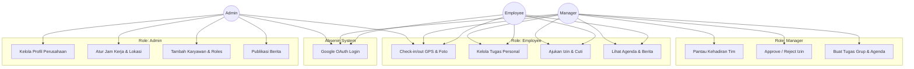

# 📋 PRODUCT REQUIREMENT DOCUMENT (PRD)
## Aplikasi Absensi Digital — "Absenin"

---

## 1. PROBLEM STATEMENT & GOAL

### Problem Statement
Banyak perusahaan dan organisasi masih menghadapi tantangan dalam manajemen kehadiran karyawan, terutama dengan model kerja hybrid (WFO/WFH). Masalah utamanya meliputi:

| No | Masalah | Dampak |
|----|---------|--------|
| 1 | Proses absensi manual mudah dimanipulasi dan sulit dilacak tanpa validasi lokasi | Data kehadiran tidak akurat, rentan kecurangan ("titip absen") |
| 2 | Kesulitan memantau absensi karyawan WFH dan WFO secara terpusat | Manajemen kehadiran menjadi kacau dan kurang terukur |
| 3 | Proses perizinan (cuti/sakit) sering kali tidak terstruktur dan menyulitkan approval | Persetujuan tertunda dan tidak ada rekam jejak |
| 4 | Karyawan dan manajer sulit memantau target harian dan tenggat waktu tugas | Produktivitas dan kinerja sulit diukur |
| 5 | Jadwal kegiatan tim sering terlewat karena tidak terpusat | Koordinasi internal menjadi kurang optimal |
| 6 | Penyebaran informasi/pengumuman perusahaan tidak efisien | Informasi penting lambat diterima karyawan |
| 7 | Unggahan foto bukti dari ponsel memakan penyimpanan server terlalu besar | Performa aplikasi lambat, biaya cloud storage membengkak |


### 🎯 Goal

Membangun platform absensi digital terintegrasi **Absenin** yang menggunakan **Google OAuth**, mendukung verifikasi lokasi **GPS (Latitude/Longitude & Alamat)**, pembagian **mode kerja WFO/WFH**, fitur produktivitas (**Tugas & Agenda**), pengelolaan **Izin & Berita**, serta menggunakan fitur kompresi foto otomatis dengan **Sharp**. Sistem mendukung **multi-role** agar bisa beradaptasi dari sisi Karyawan, Manajer, maupun Admin Perusahaan.

---

## 2. PROJECT SCOPE

### ✅ In Scope

| Area | Deskripsi |
|------|-----------|
| **Auth** | Login via Google OAuth 2.0 menggunakan Supabase Auth |
| **Role Management** | Pengguna dapat memiliki role Admin, Manager, dan Employee |
| **Check-in / Check-out** | Mencatat GPS (Lat/Long), Alamat, Foto Bukti, Mode Kerja (WFO/WFH), dan Tanggal/Waktu |
| **Manajemen Tugas** | Fitur To-Do List (Personal / Grup) dengan judul, catatan, dan batas waktu (deadline) |
| **Agenda Kegiatan** | Kalender jadwal kegiatan tim dengan waktu mulai dan berakhir |
| **Manajemen Izin** | Kategori Sakit/Cuti/Izin dengan fitur upload lampiran dan status persetujuan |
| **Portal Berita** | Publikasi pengumuman & Tips/Info dengan sampul foto berita |
| **Kelola Perusahaan** | Pengaturan lokasi kantor (GPS/Alamat) dan penetapan hari/jam kerja |
| **Kelola Karyawan** | Undang anggota ke perusahaan dan set peran (Admin/Manager/Employee) |
| **Image Compression** | Kompresi otomatis pada sisi server menggunakan `sharp` untuk foto absen & berita |

### ❌ Out of Scope (v1)

- Integrasi sistem payroll / penggajian
- Validasi wajah dengan AI (Face Recognition)
- Mesin fingerprint eksternal
- Sistem multi-bahasa

---


## 3. KONSEP DAN ARSITEKTUR

### 🏗️ Tech Stack

┌──────────────────────────────────────────────────────────────┐
│                    FRONTEND (PWA / WEB)                      │
│                                                              │
│  Next.js + TailwindCSS + shadcn/ui                           │
│  React Leaflet (Maps) + Geolocation API                      │
│  Mobile-first • Responsive                                   │
└───────────────────────────┬──────────────────────────────────┘
                            │
                       Server Actions
                            │
┌───────────────────────────▼──────────────────────────────────┐
│                     BACKEND & API                            │
│                                                              │
│  Next.js API Routes (Node.js runtime)                        │
│  Image Processing: Sharp                                     │
│  Supabase Client SSR                                         │
└───────────────────────────┬──────────────────────────────────┘
                            │
┌───────────────────────────▼──────────────────────────────────┐
│                  DATABASE & STORAGE                          │
│                                                              │
│  PostgreSQL (Supabase)                                       │
│  Supabase Auth (Google OAuth)                                │
│  Row Level Security (RLS) untuk keamanan akses               │
│                                                              │
│  Supabase Storage                                            │
│  → Foto absensi (terkompresi)                                │
│  → Lampiran izin & Foto berita                               │
└──────────────────────────────────────────────────────────────┘

### 🧱 Arsitektur Sistem
```text
                 ABSENIN
                    │
        ┌───────────┴───────────┐
        │                       │
   Frontend UI             Server Actions
   Next.js (App)           (Node.js / API)
   TailwindCSS             Sharp (Image)
   shadcn/ui               Supabase Client
        │                       │
        └───────────┬───────────┘
                    │
        ┌───────────┼───────────┐
        │           │           │
   PostgreSQL    Storage      Auth
   (Supabase)  (Supabase)   (Google)
```

### 🔐 Authentication Flow

```text
User → Klik "Login with Google" → Google OAuth Consent Screen
  → Google returns identitas ke Supabase Auth
  → Sistem cek data di tabel `profiles` dan role di `profile_roles`
  → Jika sukses: redirect ke Dashboard sesuai scope Role (Admin/Manager/Employee)
```

---

### Tech Stack Detail

| Layer              | Teknologi                           | Peran                                             |
| ------------------ | ----------------------------------- | ------------------------------------------------- |
| **Frontend**       | Next.js + Tailwind CSS + shadcn/ui  | UI PWA mobile-first dan responsive                |
| **Maps & Lokasi**  | React Leaflet / Geolocation API     | Pengambilan dan pin Lat/Long                      |
| **Backend / API**  | Next.js Server Actions              | Business logic, form handling                     |
| **Image Process**  | `sharp` (npm package)               | Kompresi foto sebelum upload ke bucket            |
| **Database**       | PostgreSQL via Supabase             | Database tersentralisasi                          |
| **Storage**        | Supabase Storage                    | Penyimpanan foto absen, berita, lampiran izin     |
| **Authentication** | Google OAuth via Supabase Auth      | Autentikasi dan sesi pengguna                     |

---

## 4. FITUR DAN SPESIFIKASI TEKNIS

### 🧩 Core Features

| # | Fitur | Role | Deskripsi Teknis |
|---|-------|------|------------------|
| F1 | Google OAuth Login | All | Login langsung menggunakan akun Google |
| F2 | GPS Check-in & Out | Karyawan | Mengambil `latitude`, `longitude`, mengubah ke alamat, + mode WFH/WFO |
| F3 | Foto & Kompresi | Karyawan | Ambil selfie, dikompres di backend menggunakan `sharp`, disimpan ke Supabase Storage |
| F4 | Daftar Tugas (Task)| All | Membuat tugas personal/grup dengan field judul, batas waktu, catatan |
| F5 | Agenda | Manager/Admin| Menjadwalkan kegiatan (nama, mulai, berakhir, deskripsi) |
| F6 | Kelola Perizinan | Karyawan/Mgr | Karyawan input sakit/cuti + bukti; Manager approve/reject status |
| F7 | Berita Perusahaan | Admin | Input judul, kategori, isi, & sampul foto; Broadcast ke dashboard karyawan |
| F8 | Kelola Perusahaan | Admin | Pengaturan jam kerja, alamat, serta koordinat GPS kantor utama |
| F9 | Kelola Karyawan | Admin | Menambah anggota, mapping `profile_roles` (Manager/Employee/Admin) |

### 🔧 Spesifikasi Teknis Detail

#### Kompresi Gambar dengan Sharp
```javascript
import sharp from 'sharp';

// Contoh utilitas kompresi di Next.js Server Actions
export async function compressImage(buffer) {
  return await sharp(buffer)
    .resize(800, 800, { fit: 'inside', withoutEnlargement: true })
    .jpeg({ quality: 70 })
    .toBuffer();
}
```

---

## 5. DESIGN / MOCKUP

### Design Style

**Color Pallete**
* PRIMARY
  * Matcha Green: `#7FAF8B`
  * Dark Matcha: `#527A5B`
  * Soft Matcha: `#E8F1E9`
* BACKGROUND
  * Warm White: `#FAFCF9`
  * Card: `#FFFFFF`
* TEXT
  * Primary: `#1F2937`
  * Secondary: `#6B7280`
* STATUS
  * Success: `#5C9A6F`
  * Warning: `#D9A441`
  * Danger: `#D96C6C`
  * Info: `#6B8FD6`

**Font**
* Heading: Plus Jakarta Sans
* Body: Inter

**UI Style**
* Minimal • Modern • Professional • Soft • Clean

### 📊 Use Case Diagram (Mermaid)


```mermaid
graph TD
    subgraph "Absenin System"
        A[Google OAuth Login]
    end

    subgraph "Role: Employee"
        K1[Check-in/out GPS & Foto]
        K2[Kelola Tugas Personal]
        K3[Ajukan Izin & Cuti]
        K4[Lihat Agenda & Berita]
    end

    subgraph "Role: Manager"
        M1[Pantau Kehadiran Tim]
        M2[Approve / Reject Izin]
        M3[Buat Tugas Grup & Agenda]
    end

    subgraph "Role: Admin"
        AD1[Kelola Profil Perusahaan]
        AD2[Atur Jam Kerja & Lokasi]
        AD3[Tambah Karyawan & Roles]
        AD4[Publikasi Berita]
    end

    EMPLOYEE((Employee)) --> A
    EMPLOYEE --> K1
    EMPLOYEE --> K2
    EMPLOYEE --> K3
    EMPLOYEE --> K4

    MANAGER((Manager)) --> A
    MANAGER --> K1
    MANAGER --> K2
    MANAGER --> K3
    MANAGER --> K4
    MANAGER --> M1
    MANAGER --> M2
    MANAGER --> M3

    ADMIN((Admin)) --> A
    ADMIN --> K1
    ADMIN --> AD1
    ADMIN --> AD2
    ADMIN --> AD3
    ADMIN --> AD4
```

---

## 6. ALUR APLIKASI (USER FLOW)

### 1. Autentikasi
* User mengakses halaman utama web Absenin.
* Memilih metode "Masuk dengan Google".
* Sistem Supabase akan menavigasikan user ke halaman Dashboard sesuai peran.

### 2. Absensi (Kehadiran)
* User berada di halaman Dashboard dan klik tombol **Check-In**.
* Sistem meminta akses geolokasi untuk mendapatkan titik *Latitude* dan *Longitude*, kemudian me-resolve alamat.
* User memilih status bekerja (WFH atau WFO).
* Mengambil foto wajah (selfie).
* Data dikirim ke server → `sharp` mengompresi foto → disimpan ke Storage → DB menyimpan kehadiran.
* Pola yang sama diulangi untuk proses **Check-Out**.

### 3. Pekerjaan (Tasks & Agenda)
* **Tugas**: User menambahkan aktivitas yang perlu diselesaikan dengan menekan "Tambah Tugas", menginput nama, deadline, dan mencatat progres.
* **Agenda**: Manager/Admin membuat entri jadwal di modul kalender untuk memudahkan transparansi waktu pertemuan dan acara tim.

### 4. Perizinan & Approval
* Karyawan yang sakit/cuti masuk ke menu **Izin**, mengisi form durasi, dan melampirkan file dokumen dokter.
* Notifikasi *pending* masuk ke halaman pengawasan **Manager**.
* Manager mengecek perizinan dan menekan "Setujui" atau "Tolak".

### 5. Pengelolaan Sistem (Admin)
* Admin men-setup perusahaan: Memasukkan GPS kantor dan mengatur jadwal hari operasional kerja.
* Admin membuat **Berita** dengan sampul gambar (otomatis dikompres) untuk di-broadcast ke seluruh halaman depan Karyawan.

---

## 7. DATABASE SCHEMA MAPPING

Desain database memetakan sepenuhnya pada arsitektur di `schema-db.md`.

| Tabel | Fungsi | Relasi / Keterangan |
|---|---|---|
| `companies` | Identitas dan konfigurasi perusahaan | Titik Lat/Long utama, alamat, jam operasional |
| `profiles` | Data karyawan terautentikasi | `company_id`, nama, email |
| `profile_roles` | Menyimpan jenis wewenang | Role `Admin`, `Manager`, `Employee` (Bisa multi-role) |
| `attendances` | Merekam histori absensi | `check_in_time`, foto URL, koordinat lokasi riil saat absen |
| `tasks` & `task_categories` | Manajemen *to-do list* harian | `deadline`, `is_completed`, milik personal atau grup |
| `agenda` & `agenda_categories` | Kalender agenda pertemuan | `start_time` hingga `end_time` |
| `leave_requests` & `leave_categories` | Proses izin dan cuti | Status: `Menunggu`, `Disetujui`, `Ditolak` |
| `news` & `news_categories` | Informasi broadcast perusahaan | `cover_image_url`, judul konten pengumuman |

### Keamanan (Row Level Security)
Setiap tabel dilindungi dengan mekanisme **RLS**. 
* Karyawan (`Employee`) hanya memiliki izin untuk menambah & mengubah data dirinya (absensi, izin, tugas).
* Manager memiliki otoritas untuk memperbarui baris izin (`leave_requests`) bawahan.
* Admin mendapatkan otoritas penuh (Update/Delete/Insert) di scope perusahaan yang dinaunginya, tapi tidak untuk data perusahaan lain.
